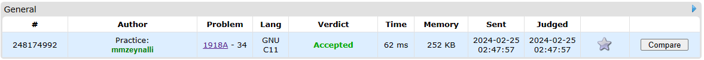

## [Problem statement](https://codeforces.com/contest/1918/problem/A)

> time limit per test: 1 second</br>
> memory limit per test: 256 megabytes</br>
> input: standard input</br>
> output: standard output

A brick is a strip of size **`1 × k`**, placed horizontally or vertically, where **`k`** can be an arbitrary number that is at least **2** (**`k ≥ 2`**).

A brick wall of size **n × m** is such a way to place several bricks inside a rectangle **n × m**, that all bricks lie either horizontally or vertically in the cells, do not cross the border of the rectangle, and that each cell of the **n × m** rectangle belongs to exactly one brick. Here **`n`** is the height of the rectangle **n × m** and **`m`** is the width. **Note** that there can be bricks with different values of k in the same brick wall.

The wall stability is the difference between the number of horizontal bricks and the number of vertical bricks. **Note** that if you used **0** horizontal bricks and **2** vertical ones, then the stability will be **−2, not 2**.

What is the maximal possible stability of a wall of size **n × m**?

It is guaranteed that under restrictions in the statement at least one **n × m** wall exists.

### Input

The first line of the input contains one integer **t** (**`1 ≤ t ≤ 10000`**), the number of test cases.

The only line of each test case contains two integers **n** and **m** (**`2 ≤ n`**, **`m ≤ 10^4`**).

### Output

For each test case, print one integer, the maximum stability of a wall of size **n × m**.

#### Example

##### input

> 5</br>
> 2 2</br>
> 7 8</br>
> 16 9</br>
> 3 5</br>
> 10000 10000

##### output

> 2</br>
> 28</br>
> 64</br>
> 6</br>
> 50000000

<hr>

## [Solution](https://github.com/Miradils-Blog/dsa-problems-and-solutions/tree/main/codeforces/1918-A-brick-wall)

> Note: in notation `a × b`, `a` is height, `b` is width.

Even though it seems as a hard problem where you need to calculate different combination of brick lengths and their layout, it is quite easy problem. I chose this problem in order to demonstrate how some problems can be solved easily, without complicating things. When one does many hard problems, they are used to think complicated. So when an easy problem comes, they go into task with that complicated focused mindset and miss simple things (happened to me a lot in chess).

So, what we know:

- We need to minimize vertical bricks and maximize the horizontal ones</br>
- Then, we need to use smallest bricks, to maximize the benefit: 2x1</br>
- We need to avoid using vertical bricks at all

So, if we use **`1 × 2`** bricks horizontally, we would have `m / 2` bricks in one layer, and that being `n` layers. Easy right? However, what if `m` is odd? then we would have column left. We can fill it with vertical bricks, however, each vertical brick is decreases stability. So, how do we fill that gap? Easy, we just make the last brick of the row `1 × 3` instead of `1 × 2`. In a result, all bricks are placed horizontal, and their count being `floor(m / 2) × n`:

```C
#include <stdio.h>

int main()
{
    int n, m, t;

    scanf("%d", &t);

    while(t--)
    {
        scanf("%d %d", &n, &m);
        printf("%d\n", m / 2 * n);
    }

    return 0;
}
```

> **NOTE:** The statement `m / 2` should happen first, as we need floor down the division (we do it by using just integer division, no need for extra functions). Otherwise, you would get wrong result.



Accepted! You can access the code [here](https://github.com/Miradils-Blog/dsa-problems-and-solutions/tree/main/codeforces/1918-A-brick-wall). Feel free to contribute your solution in different language!
