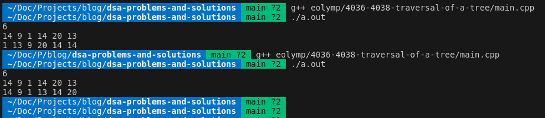

## [Problem statement](https://www.eolymp.com/en/problems/4038)

> These are two identical problems: Eolymp [4036](https://www.eolymp.com/en/problems/4036) and [4038](https://www.eolymp.com/en/problems/4038).
>
> The following problem statement is that of 4038, but explanation covers both problems.

Given an array of integers. Create a Binary Search Tree from these numbers. If the inserted value equals to the current node, insert it to the **right** subtree.

Write method **PostOrder** that makes Post-Order traversal of a tree. In this traversal method the left subtree is visited first, then the right subtree and finally the root node.



Write the code according to the next interface:

```C++
class TreeNode
{
public:
    int val;
    TreeNode *left;
    TreeNode *right;

    TreeNode(int x) : val(x), left(NULL), right(NULL) {}
};

class Tree
{
public:
    TreeNode *head;
    Tree() : head(NULL) {};

    void Insert(int val); // Insert number val to Binary Search Tree
    void PostOrder(void); // Print the vertices of a tree according to post-order traversal
};
```

You can create (use) additional methods if needed.

#### Input data

The first line contains number n (**1** $\leq$ **n** $\leq$ **100**). The second line contains n integers.

#### Output data

Create the Binary Search Tree from input data. Print the vertices of a tree according to post-order traversal.

#### Examples



##### Input example #1

6</br>
14 9 1 14 20 13

---

##### Output example #1

14 9 1 13 14 20



<hr>

## [Solution](https://github.com/Miradils-Blog/dsa-problems-and-solutions/tree/main/eolymp/4036-4038-traversal-of-a-tree)

First, we need to understand binary search tree. It is a tree, where each node has at most two children (thus binary). For each subtree, the left contains values less than subtree root value, and the right contains the values more than that. Considering that the first value is always the root of the whole tree, we can derive the next insertion steps: if the new value is less than root node, we go to left, otherwise to right subtree. we iterate through each subtree (again, if less go left, if more go right) until we find a empty node. When empty node is found we add the value there. This makes our binary search tree sorted always, which is one of the benefits of this data structure (check problem statement image). So, our insert function would look like this:

```C++
void insert(Node *&node, int n)
{
    if (node == NULL)  // found empty place
    {
        node = new Node(n);
        return;
    }

    if (n < node->val)  // if less, go left
        insert(node->left, n);
    else
        insert(node->right, n);  // if same or more, go right
}
```

That's it! Our binary tree is done! The next step is to add traversal functions. So, if we want to print sorted output, we would always print the left subtree (lower values), then current node, then right subtree (higher values). However, we are asked preorder (4036) and postorder (4038) output. Then, we just change the order of printing:

```C++
void PreOrder(Node *node)
{
    if (node == NULL)
        return;

    printf("%d ", node->val);
    PreOrder(node->left);
    PreOrder(node->right);
}

void PostOrder(Node *node)
{

    if (node == NULL)
        return;

    PostOrder(node->left);
    PostOrder(node->right);
    printf("%d ", node->val);
}
```

So, the whole code looks like this:

```C++
#include <bits/stdc++.h>
using namespace std;

class Node
{
public:
    int val;
    Node *left, *right;

    Node(int n)
    {
        val = n;
        left = right = NULL;
    }
};

class Tree
{
public:
    Node *head;

    Tree()
    {
        head = NULL;
    }

    void insert(int n)
    {
        insert(head, n);
    }

    void insert(Node *&node, int n)
    {

        if (node == NULL)
        {
            node = new Node(n);
            return;
        }

        if (n < node->val)
            insert(node->left, n);
        else
            insert(node->right, n);
    }
};

void PreOrder(Node *node)
{
    if (node == NULL)
        return;

    printf("%d ", node->val);
    PreOrder(node->left);
    PreOrder(node->right);
}

void PostOrder(Node *node)
{
    if (node == NULL)
        return;

    PostOrder(node->left);
    PostOrder(node->right);
    printf("%d ", node->val);
}

int main()
{
    int n, a;
    Tree t;

    scanf("%d", &n);

    while (n--)
    {
        scanf("%d", &a);
        t.insert(a);
    }

    // PreOrder(t.head);
    PostOrder(t.head);
    printf("\n");

    return 0;
}
```

So, if we test our code:



The first one is **postorder**, and the second is **preorder**. It works! Now, if we submit:




---




Two A's! Yay! You can access the code [here](https://github.com/Miradils-Blog/dsa-problems-and-solutions/tree/main/eolymp/4036-4038-traversal-of-a-tree). Feel free to contribute your solution in different language!
