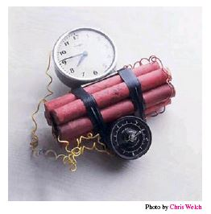
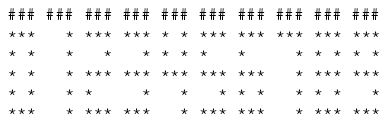
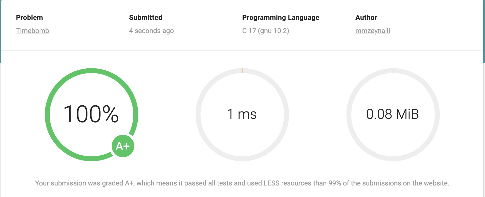

## [Problem statement](https://www.eolymp.com/en/problems/6254)



You and your teammates from the anti-bomb squad of the local police have been called to defuse a bomb found in the only pub in town. Fearing the tragic consequences this might produce, you go to the scene as quickly as possible. After some research, you learn that the bad guys have created a tricky way to allow them to defuse the bomb at will. You find a remote control with a button that you can take to a safe place. You also find that it is possible to connect to the bomb through a wireless connection and retrieve an ASCII representation of a code every **2** seconds. The bomb then gets defused if the button is pressed when the code is a number divisible by **6**. But you have to be careful. If you press the button when the ASCII representation of the code is not a number divisible by **6** or has an invalid representation for any digit, the bomb will explode instead.

You have to rely on your programming skills to write a program able to tell you if it is safe to press the button, before it blows out the pub (and the beer).

### Input data

Consists of an ASCII representation of a code. This code has between **2** and **8** digits. Each digit is represented by **5** rows and **3** columns of characters, which can be either a space or a star character **'\*'**. No other type of character (except for the new line character) will ever appear in the input. There is also one column of spaces (and only spaces) to separate each digit. After the last digit you will find a column of new line characters. Note that although every digit will always be of size **5 × 3**, there is no guarantee it will represent a valid digit between **0** and **9** inclusive. The valid **5 × 3** representations for each digit are given below.



The hash '#' characters on the top are there only to mark the **3** columns used for a digit and are not part of the digits' representation.

The code can have leading zeros, hence an ASCII representation of, for example, **00000076** represents the number **76**. You may also safely assume that every valid code will correspond to a strictly positive number.

### Output data

Print one line with **"BEER!!"** if it is safe to press the button and defuse the bomb, and **"BOOM!!"** otherwise.

### Examples



#### Input example #1

```text
***   * * * *** *** *** ***
* *   * * *   *   *   * *  
* *   * *** *** *** *** ***
* *   *   * *     * *   * *
***   *   * *** *** *** ***
```

#### Input example #2

```text
  *   * *** *** *** * *
  *   * **    * * * * *
  *   * *** *** *** ***
  *   * *   *   * *   *
  *   * *** *** ***   *

```

#### Input example #3

```text
*** ***
* * *  
*** * *
* * * *
*** ***
```

---

#### Output example #1

```text
BEER!!


 
```

#### Output example #2

```text
BOOM!!


 
```

#### Output example #3

```text
BOOM!!


 
```



<hr>

## [Solution](https://github.com/Miradils-Blog/dsa-problems-and-solutions/tree/main/eolymp/6254-timebomb)

This is not a hard problem, however, it needs careful data handling. First, we need to identify "numbers": we will have a constant array with predefined numbers and their "star form". After that, we need to process the input. We know that we have five lines of input and each digit is taking three columns. The bundle of three characters in a line defines a digit, so, we also need to know the number of digits or handle it without knowing it. We know that we can have a maximum of 8 digits, so the array length will be that. After that, we process 3+1 characters at a time, the fourth character being whitespace: either space or newline character (for the last digit). If it is space, we move to the next digit, else, if it is newline, we store the next row for each digit:

```C
#include <stdio.h>
#include <string.h>

const char digits[10][16] = {
    {"**** ** ** ****"}, // 0
    {"  *  *  *  *  *"}, // 1
    {"***  *****  ***"}, // 2
    {"***  ****  ****"}, // 3
    {"* ** ****  *  *"}, // 4
    {"****  ***  ****"}, // 5
    {"****  **** ****"}, // 6
    {"***  *  *  *  *"}, // 7
    {"**** ***** ****"}, // 8
    {"**** ****  ****"}, // 9
};

int main(void)
{
    char bombtime[8][16];
    int digitp;  // digit poimnt
    char ws; // whitespace
    char in[4];

    for (int i = 0; i < 5; ++i)  // we need to know at which line we are to store at the right address
    {
        digitp = 0; // at each line, we start storing to 0th index

        while(scanf("%3[* ]%c", in, &ws))  // NOTE 1
        {
            // NOTE 2
            memcpy(bombtime[digitp] + (i * 3), in, 3); // store the next three chars in `bombtime`

            if (ws == '\n')
                break;

            ++digitp;
        }
    }

    //digitp is also the number of digits at this point

    int res = 0, j;

    for (int i = 0; i <= digitp; ++i)
    {
        j = 0;
        for (; j < 10; ++j)
            if (!strcmp(bombtime[i], digits[j]))
            {
                res = res * 10 + j;  // j is digit, shift res to left (* 10), and add j
                break;
            }

        // NOTE 3
        if (j == 10) // No such digit found, gibberish
        {
            res = -1;
            break;
        }
    }

    printf("%s\n", (res % 6) ? "BOOM!!" : "BEER!!");

    return 0;
}
```

Some notes about the code:

> NOTE 1 (`scanf`): `%3[* ]` means scanning **3** chars that are either `*` or space.</br>
> NOTE 2 (`memcpy`): each time we store 3 digits/chars in the needed address, which is `[digitp][linenum * 3]`.</br>
> NOTE 3 (`j == 10`): the task says: **there is NO GUARANTEE it will represent a valid digit between 0 and 9 inclusive.**

So, if we submit this code:



A+! Yay! You can access the code [here](https://github.com/Miradils-Blog/dsa-problems-and-solutions/tree/main/eolymp/6254-timebomb). Feel free to contribute your solution in a different language!
