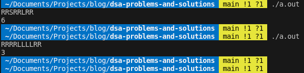
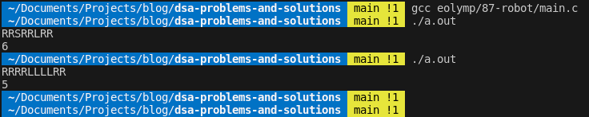

## [Problem statement](https://www.eolymp.com/en/problems/87)

The infinite in both directions stripe with width **1** is divided into blocks of size **1 x 1**. In one of these blocks the robot is located. It can move from one cell to another (the robot at the figure is marked with square). Its movements are determined by the program, each instruction is given by one of three capital letters: **L**, **R**, **S**. The instruction **L** says the robot to move one cell to the left, the instruction **R** - to move one square right, and **S** - to stay in the same cell. Program execution means the sequential execution of all instruction in it.





Write a program that will determine how many different cells visits the robot.

#### Input data

The program for the robot is a string of characters **L**, **R**, **S**. The program consists of no more than 10^4 instructions.



#### Output data

Print the number of different cells that visits the robot performing the program.



#### Examples



##### Input example #1

RRSRRLRR

---

##### Output example #1

6



<hr>

## [Solution](https://github.com/Miradils-Blog/dsa-problems-and-solutions/tree/main/eolymp/87-robot)

Let's first analyze how the input works. If we run the input sequence, we will have the following result:



### The wrong first idea

Over the years, whenever I have given this problem to my students, their first plan was to an index variable, and keep the track of the robot, and the last position is enough to calculate the number of cells it was in.

```C
#include <stdio.h>
#include <string.h>

int main(void) {
    char input[10001];
    int ind = 0;
    scanf("%s", input);

    int len = strlen(input);

    for (int i = 0; i < len; ++i)
    {
        if (input[i] == 'R')
            ++ind;
        else if (input[i] == 'L')
            --ind;
    }

    printf("%d\n", ind + 1);  // consider initial position

    return 0;
}
```

The problem is that, this method works with given solution (output is indeed 6), but if in some substring, number of Ls are more than number of Rs (let's say, our input is as RRRRLLLLRR), then the solution fails:



Instead, we have to tackle problem differently: as it is 1x1 dimension, we can set the leftmost and the rightmost position the robot has been as the border.





Because of the given dimension, we know that, the every cell between those borders are painted, even if the robot is in the middle of the range. Whenever, the robot goes beyond these ranges, it pushes the ranges as well. So, if we implement it to the code and also remove char array, by reading character by character, reducing memory usage:

```C
#include <stdio.h>

int main()
{
    char in;
    int leftmost = 0, rightmost = 0, ind = 0;

    while(scanf("%c", &in) == 1 && (in == 'L' || in == 'R' || in == 'S'))
    {
        if(in == 'R')
        {
            ++ind;
            if (ind > rightmost)
                rightmost = ind;
        }
        else if (in == 'L')
        {
            --ind;
            if (ind < leftmost)
                leftmost = ind;

        }
    }

    printf ("%d", rightmost - leftmost + 1);
    return 0;
}
```



As leftmost is non-positive, subtracting it means adding its absolute value. For this solution we get the output:





And if we submit this:







A big fat A+! We have also used less resources than 99% of submissions. Yay! You can access the code [here](https://github.com/Miradils-Blog/dsa-problems-and-solutions/tree/main/eolymp/87-robot). Feel free to contribute your solution in different language!
