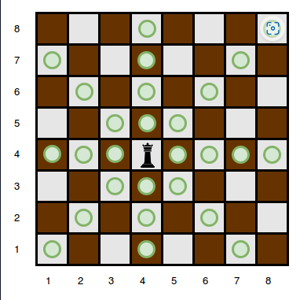
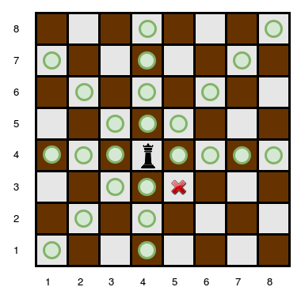
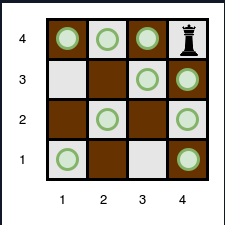
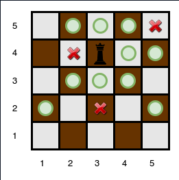

## [Problem statement](https://www.hackerrank.com/challenges/queens-attack-2/problem)

You will be given a square chess board with one queen and a number of obstacles placed on it. Determine how many squares the queen can attack.

A queen is standing on an $n \times n$ chessboard. The chess board's rows are numbered from $1$ to $n$, going from bottom to top. Its columns are numbered from  $1$ to $n$, going from left to right. Each square is referenced by a tuple, $(r, c)$, describing the row, $r$, and column, $c$, where the square is located.

The queen is standing at position $(r_q, c_q)$. In a single move, she can attack any square in any of the eight directions (left, right, up, down, and the four diagonals). In the diagram below, the green circles denote all the cells the queen can attack from $(4, 4)$:



There are obstacles on the chessboard, each preventing the queen from attacking any square beyond it on that path. For example, an obstacle at location $(3, 5)$ in the diagram above prevents the queen from attacking cells $(3, 5)$, $(2, 6)$, and $(1, 7)$:



Given the queen's position and the locations of all the obstacles, find and print the number of squares the queen can attack from her position at $(r_q, c_q)$. In the board above, there are $24$ such squares.

#### Function Description

Complete the queensAttack function in the editor below.

queensAttack has the following parameters:

- int n: the number of rows and columns in the board
- nt k: the number of obstacles on the board
- int r_q: the row number of the queen's position
- int c_q: the column number of the queen's position
- int obstacles[k][2]: each element is an array of $2$ integers, the row and column of an obstacle

#### Returns

- int: the number of squares the queen can attack

#### Input Format

The first line contains two space-separated integers $n$ and $k$, the length of the board's sides and the number of obstacles.
The next line contains two space-separated integers $r_q$ and $c_q$, the queen's row and column position.
Each of the next $k$ lines contains two space-separated integers $r[i]$ and $c[i]$, the row and column position of $obstacle[i]$.

#### Constraints

- $0 < n \leq 10^5$
- $0 \leq k \leq 10^5$
- A single cell may contain more than one obstacle.
- There will never be an obstacle at the position where the queen is located.

#### Subtasks

For $30 \%$ of the maximum score:

- $0 < n \leq 100$
- $0 \leq k \leq 100$

For $55 \%$ of the maximum score:

- $0 < n \leq 1000$
- $0 \leq k \leq 10^5$

#### Sample Input 0

> 4 0\
> 4 4

#### Sample Output 0

> 9

#### Explanation 0

The queen is standing at position $(4, 4)$  on a $4 \times 4$ chessboard with no obstacles:



#### Sample Input 1

> 5 3\
> 4 3\
> 5 5\
> 4 2\
> 2 3

#### Sample Output 1

> 10

#### Explanation 1

The queen is standing at position $(4, 3)$ on a $5 \times 5$ chessboard with $k=3$ obstacles:



The number of squares she can attack from that position is $10$.

#### Sample Input 2

> 1 0\
> 1 1

#### Sample Output 2

> 0

#### Explanation 2

Since there is only one square, and the queen is on it, the queen can move 0 squares.

<hr>

## [Solution](https://github.com/Miradils-Blog/dsa-problems-and-solutions/tree/main/hackerrank/queens-attack-2)

### Hard-Coded solution

At first glance, this is not that hard to solve. We will have just bunch of `if` statements, and handle each of them accordingly. Let's have array of possible moves for each direction (8 in total). To make it more chess-like, let's make it $3 \times 3$ (later explained why). So, the initial possible moves at each direction would be:

```C
#define min(a, b) ((a) < (b) ? (a) : (b))

int queensAttack(int n, int k, int r_q, int c_q, int obstacles_rows, int obstacles_columns, int **obstacles)
{
    int possible[3][3];
    possible[1][1] = 0; // not used

    possible[0][1] = n - r_q; // up
    possible[1][2] = n - c_q; // right
    possible[1][0] = c_q - 1; // left
    possible[2][1] = r_q - 1; // down

    possible[0][0] = min(possible[0][1], possible[1][0]); // up left
    possible[0][2] = min(possible[0][1], possible[1][2]); // up right
    possible[2][0] = min(possible[2][1], possible[1][0]); // down left
    possible[2][2] = min(possible[2][1], possible[1][2]); // down right
}
```

If you think 2D array visually, the structure of `possible` makes sense. `[0][0]` would be top-left, and `[2][2]` would correspond to bottom-right corner.

The possible moves to up, right, left and down directions are obvious. However, in diagonals, it is the minimum of two adjacent directions (see image examples above, or think that, it should be able to move in two directions simultaneously, so shortest one stops first). Now, we just need to understand where each obstacle is compared to queen, and update corresponding value:

```C
#define min(a, b) ((a) < (b) ? (a) : (b))

int queensAttack(int n, int k, int r_q, int c_q, int obstacles_rows, int obstacles_columns, int **obstacles)
{
    int possible[3][3];
    possible[1][1] = 0; // not used

    possible[0][1] = n - r_q; // up
    possible[1][2] = n - c_q; // right
    possible[1][0] = c_q - 1; // left
    possible[2][1] = r_q - 1; // down

    possible[0][0] = min(possible[0][1], possible[1][0]); // up left
    possible[0][2] = min(possible[0][1], possible[1][2]); // up right
    possible[2][0] = min(possible[2][1], possible[1][0]); // down left
    possible[2][2] = min(possible[2][1], possible[1][2]); // down right

    int r_o, c_o;
    for (int i = 0; i < k; ++i)
    {
        r_o = obstacles[i][0];
        c_o = obstacles[i][1];

        if (r_o == r_q)
        {
            if (c_o < c_q) // obstacle is to the left
                possible[1][0] = min(possible[1][0], c_q - c_o - 1);
            else // obstacle is to the right
                possible[1][2] = min(possible[1][2], c_o - c_q - 1);
        }
        else if (c_o == c_q)
        {
            if (r_o < r_q) // obstacle is to the bottom
                possible[2][1] = min(possible[2][1], r_q - r_o - 1);
            else // obstacle is to the top
                possible[0][1] = min(possible[0][1], r_o - r_q - 1);
        }
        else if (abs(r_o - r_q) == abs(c_o - c_q)) // diagonal
        {
            if (r_o > r_q && c_o < c_q) // top-left diagonal
                possible[0][0] = min(possible[0][0], r_o - r_q - 1);
            else if (r_o > r_q && c_o > c_q) // top-right diagonal
                possible[0][2] = min(possible[0][2], r_o - r_q - 1);
            else if (r_o < r_q && c_o < c_q) // bottom-left diagonal
                possible[2][0] = min(possible[2][0], r_q - r_o - 1);
            else // bottom-right diagonal
                possible[2][2] = min(possible[2][2], r_q - r_o - 1);
        }
    }

    int sum = 0;

    for (int i = 0; i < 3; ++i)
        for (int j = 0; j < 3; ++j)
            sum += possible[i][j];

    return sum;
}
```

Each time, get obstacle, we first check if it is in queen's way. If it is, we find which direction it is, and minimize that direction given obstacles coordinates. If we submit this code:


Yay, it worked! Of course, it did we almost hard coded everything. When I saw this problem, this solution came to my mind. However, I wanted solution that would satisfy me. I never went with solution above (wrote it for the sake of this post). We are better than this right? What if we remove all `if` statements and have optimal code which finds needed arrays element and minimizes it?

### Elegant Solution

First, we need to understand how we can map `r` and `c` to indexes of `possible`. The thing is, we do not even need the indexes of obstacles. Knowing the difference of obstacle indexes with queen indexes gives plenty information to us. So, if we take:

- `diffr = r_q - obstacle[i][0]`
- `diffc = obstacle[i][1] - c_q` (because of the directions, read further)
- Let's consider non-diagonal directions
  - Either `diffr` or `diffc` will be zero.
  - If `diffr` is zero, it means we need `possible[1][?]`
    - If `diffc` is negative, it means it is in left, so `possible[1][0]`
    - If `diffc` is positive, it means it is in right, so `possible[1][2]`
  - If `diffc` is zero, it means we need `possible[?][1]`
    - If `diffr` is positive, it means it is in top, so `possible[0][1]`
    - If `diffr` is negative, it means it is in bottom, so `possible[2][1]`
- Now, let's consider diagonal directions
  - `diffr == diffc`
  - If both negative, bottom-left, so `possible[2][0]`
  - If both positive, top-right, so `possible[0][2]` (that is why we took `obstacle[i][1] - c_q`, to have same positive and negatives)
  - Otherwise, it is `possible[0][0]` or `possible[2][2]`

Too much analysis, I know. However, one can see that, we are basically focused on sign of differences. Considering the sign is either -1, 0 or 1, one can map these statements into single line of code. That's right, the index of needed value is `[1 - sign(diffr)][1 - sign(diffc)]`. If we analyze statements above:

- If `diffr` is zero, it is `possible[1][?]`, and the same for `diffc`
- If `diffr` or `diffc` is negative, it is index 2: `possible[2][?]` or `possible[?][2]`
- Otherwise, it is index 0

So, we can wrap all those `if` statements into this perfect one-liner:

`possible[1 - sign(diffr)][1 - sign(diffc)] = min(possible[1 - sign(diffr)][1 - sign(diffc)], max(abs(diffr), abs(diffc)) - 1);`

Perfect, isn't it?) We have the part `max(abs(diffr), abs(diffc)) - 1)` as we need non-zero value (in case it is on top, right, left or bottom). How would our `sign` function be? Well, as expected right?

```C
int sign(int a)
{
    return (a > 0) ? 1 : ((a < 0) ? -1 : 0);
}
```

What if I told you, we can be more elegant?

```C
int sign(int a)
{
    return (a > 0) - (a < 0);
}
```

I am leaving you two alone to get to know each other...

So, our whole solution would be:

```C
#define min(a, b) ((a) < (b) ? (a) : (b))
#define max(a, b) ((a) > (b) ? (a) : (b))

int sign(int a)
{
    return (a > 0) - (a < 0);
}

int queensAttack(int n, int k, int r_q, int c_q, int obstacles_rows, int obstacles_columns, int **obstacles)
{
    int possible[3][3];
    possible[1][1] = 0; // not used

    possible[0][1] = n - r_q; // up
    possible[1][2] = n - c_q; // right
    possible[1][0] = c_q - 1; // left
    possible[2][1] = r_q - 1; // down

    possible[0][0] = min(possible[0][1], possible[1][0]); // up left
    possible[0][2] = min(possible[0][1], possible[1][2]); // up right
    possible[2][0] = min(possible[2][1], possible[1][0]); // down left
    possible[2][2] = min(possible[2][1], possible[1][2]); // down right

    int diffr, diffc;
    for (int i = 0; i < k; ++i)
    {
        diffr = obstacles[i][0] - r_q;
        diffc = c_q - obstacles[i][1];

        if (!diffr || !diffc || abs(diffr) == abs(diffc))
        {
            possible[1 - sign(diffr)][1 - sign(diffc)] = min(possible[1 - sign(diffr)][1 - sign(diffc)], max(abs(diffr), abs(diffc)) - 1);
        }
    }

    int sum = 0;

    for (int i = 0; i < 3; ++i)
        for (int j = 0; j < 3; ++j)
            sum += possible[i][j];

    return sum;
}
```

No ifs, no control, just pure math. ELEGANT!


Now, if we submit:


Perfect, it works! Yay! You can find solutions [here](https://github.com/Miradils-Blog/dsa-problems-and-solutions/tree/main/hackerrank/queens-attack-2). Feel free to contribute your solution in different language!
