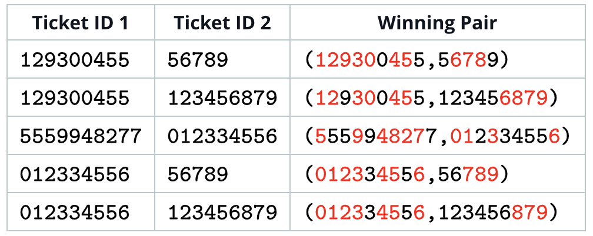
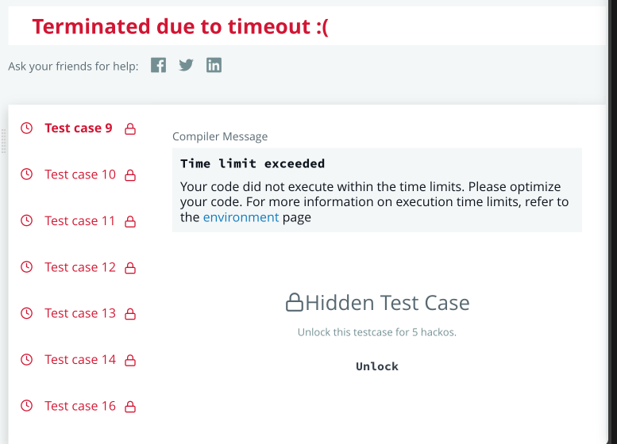
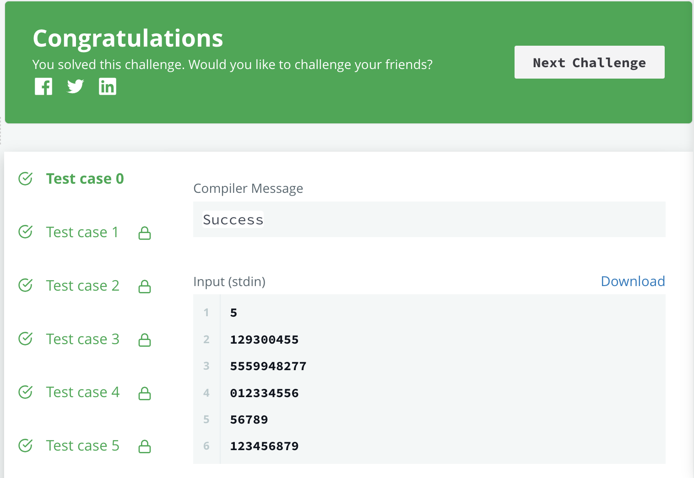

## [Problem statement](https://www.hackerrank.com/challenges/winning-lottery-ticket)

The SuperBowl Lottery is about to commence, and there are several lottery tickets being sold, and each ticket is identified with a ticket ID. In one of the many winning scenarios in the Superbowl lottery, a winning pair of tickets is:

- Concatenation of the two ticket IDs in the pair, in any order, contains each digit from **0** to **9** at least once.

For example, if there are **2** distinct tickets with ticket ID **129300455** and **56789**, **(129300455, 56789)** is a winning pair.

NOTE: The ticket IDs can be concatenated in any order. Digits in the ticket ID can occur in any order.

Your task is to find the number of winning pairs of distinct tickets, such that concatenation of their ticket IDs (in any order) makes for a winning scenario. Complete the function `winningLotteryTicket` which takes a string array of ticket IDs as input, and return the number of winning pairs.

### Input Format

The first line contains ***n*** denoting the total number of lottery tickets in the super bowl.</br>
Each of the next ***n*** lines contains a string, where string on a **$i^{th}$** line denotes the ticket id of the **$i^{th}$** ticket.

### Constraints

- $0 \leq n \leq 10^6$
- $1 \leq $ length of **ticket_i** $ \leq 10^6$
- sum of lengths of all **ticket_i** $\leq 10^6$
- Each ticket_id consists of digits from $\lbrack 0, 9\rbrack$

### Output Format

Print the number of pairs in a new line.

#### Sample Input 0

> 5</br>
> 129300455</br>
> 5559948277</br>
> 012334556</br>
> 56789</br>
> 123456879

#### Sample Output 0

> 5

#### Explanation 0

Pairs of distinct tickets that make for a winning scenario are:



Notice that each winning pair has digits from **0** to **9** at least once, and the digits in the ticket ID can be of any order. Thus, the number of winning pairs is **5**.

<hr>

## [Solution](https://github.com/Miradils-Blog/dsa-problems-and-solutions/tree/main/hackerrank/winning-lottery-ticket)

This question is a little bit tricky. Of course, we could loop through a couple of tickets and check their "compatibility". However, we need an extra loop (on top of a double loop for pairs of tickets) to check the digits of each ticket pair string. However, we could loop through the list of tickets before and remember their digits, and then compare the pairs. But, how do we store this information, such that we don't need an extra loop for checking compatibility? If we used `set` (C++), it would be extra `O(logn)` complexity. Bit manipulation is here to save the day!

The solution is easy to implement, however hard to come up with. Before comparing pairs, we will loop through the tickets and store digits in bits of a number as in bitmask. If a ticket has zero, its bitmask will have `1` in `bit 0`. Similar will be to other digits, and if all bits are set, then the bitmask will be `0b1111111111`, which is equal to `1023` in decimal form. So, if we "merge" to tickets and all bits are set, it is a winning ticket as, all digits are present (remember, order does not matter).

```C
#define ALL_BITS_SET 1023

long winningLotteryTicket(int tickets_count, char** tickets) {
    int *bitmasks = calloc(tickets_count, sizeof(int));
    int len;
    int cnt = 0;

    for (int i = 0; i < tickets_count; ++i)
        for (int j = 0, len = strlen(tickets[i]); j < len; ++j)
            bitmasks[i] |= 1 << (tickets[i][j] - '0'); // set n-th bit to 1

    for (int i = 0; i < tickets_count; ++i)
        for (int j = i + 1; j < tickets_count; ++j)
            if ((bitmasks[i] | bitmasks[j]) == ALL_BITS_SET)
                ++cnt;

    return cnt;
}
```

Now, if we submit:



Hmm, even though test cases 0-8 were correct, test cases 9-16 resulted in a timeout. This means, our solution is correct, but, it should be optimized. So, how can we? First, we can ignore the tickets that contain all digits, as their combination with any ticket is the winning one. Moreover, tickets like **10001** and **0000001** are basically the same, as they contain two same digits. So, we can store them in one storage, and multiply the result by count, thus going over one ticket of each bitmask. So, let's create an array of bitmasks that store the count of such tickets:

```C
#define BITMASK_MAX 1024
#define ALL_BITS_SET ((BITMASK_MAX) - 1)

long winningLotteryTicket(int tickets_count, char** tickets) {
    int *bitmask_cnt = calloc(BITMASK_MAX, sizeof(int));
    int len;
    int bitmask;
    long cnt = 0;

    for (int i = 0; i < tickets_count; ++i)
    {
        bitmask = 0;

        for (int j = 0, len = strlen(tickets[i]); j < len; ++j)
            bitmask |= 1 << (tickets[i][j] - '0'); // set n-th bit to 1
        
        ++bitmask_cnt[bitmask]; // group same bitmask tickets
    }

    // ignore bitmask[1023], as tickets with those bitmasks is compatible with any ticket
    for (int i = 0; i < BITMASK_MAX - 1; ++i)
        for (int j = i + 1; j < BITMASK_MAX - 1; ++j)
            if ((i | j) == ALL_BITS_SET)
                cnt += (long)bitmask_cnt[i] * bitmask_cnt[j];  // all combinations of these groups

    /* 
    * each bitmask_cnt[ALL_BITS_SET] is compatible with all of the rest of the tickets
    * and as we need to ignore duplicate tuples:
    * The first "all-digits-included" ticket will have (tickets_cnt - 1) combinations
    * second will have (tickets_cnt - 2) combinations
    * third will have (tickets_cnt - 3) combinations and so on.
    * so, we have arithmetic progression from [tickets_cnt - bitmask_cnt[ALL_BITS_SET], ticket_cnt - 1]
    * sum = n * (a1 + an) / 2 =>  
    * bitmask_cnt[ALL_BITS_SET] * (tickets_cnt - bitmask_cnt[ALL_BITS_SET] + (tickets_cnt - 1)) / 2
    * so, total = bitmask_cnt[ALL_BITS_SET] * (2 * tickets_count - bitmask_cnt[ALL_BITS_SET] - 1)) / 2
    */
    return cnt + (((long)bitmask_cnt[ALL_BITS_SET] * (2 * tickets_count - bitmask_cnt[ALL_BITS_SET] - 1)) / 2);
}
```

To sum up:

- Our `bitmask_cnt` array indexes are bitmask values of tickets, and values are their count, thus grouping the same bitmask tickets
- We iterate through bitmasks (contrary to tickets). If joining two bitmasks results in an all-digits-included ticket, we add the count of all possible combinations of such tickets
- We exclude tickets which has all digits from the start of that search. After the loop, we use the arithmetic series formula to find all non-duplicate combinations of full-digit tickets with the rest.

> **NOTE:**</br>
> You can see that we cast array elements to `long`. This is because multiplying `int` with `int` results in `int`, and if there is an overflow in multiplication we will lose data.</br>
> If we cast one of the operators to `long` the result will be `long` and no data will be truncated.</br>
> We could have used `long *bitmask_cnt`, however, the bigger space would be allocated for that array, which we don't need. Thus, casting during operation is sufficient.

If we submit:



Perfect, it works! Yay! You can find solutions [here](https://github.com/Miradils-Blog/dsa-problems-and-solutions/tree/main/hackerrank/winning-lottery-ticket). Feel free to contribute your solution in a different language!
