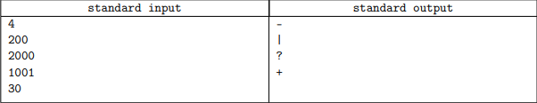
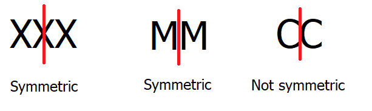
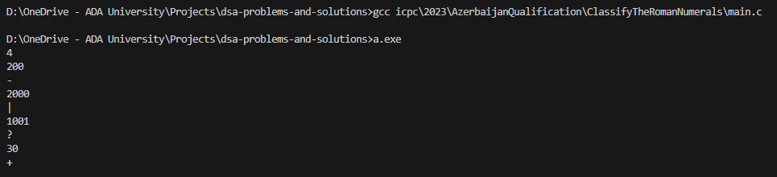

> **This problem is from ICPC competition that one of my followers participated (and asked for explanation) on October 22, 2023.**

## Problem statement

Your task is to determine the number of symmetry axis of the given Roman Numeral.

The following table from Wikipedia displays how the Roman Numerals are written:

| Individual decimal places | Thousands | Hundreds | Tens | Units |
|:-------------------------:|:---------:|:--------:|:----:|:-----:|
|             1             |     M     |     C    |   X  |   I   |
|             2             |     MM    |    CC    |  XX  |   II  |
|             3             |    MMM    |    CCC   |  XXX |  III  |
|             4             |           |    CD    |  XL  |   IV  |
|             5             |           |     D    |   L  |   V   |
|             6             |           |    DC    |  LX  |   VI  |
|             7             |           |    DCC   |  LXX |  VII  |
|             8             |           |   DCCC   | LXXX |  VIII |
|             9             |           |    CM    |  XC  |   IX  |



Note that:

• The numerals for 4, 9, 40, 90, 400 and 900 are written using "subtractive notation" where the first symbol is subtracted from the larger one (for example, for 40 ("XL") 'X' (10) is subtracted from 'L' (50)). These are **the only** subtractive forms in standard use.

• A number containing several decimal digits is built by appending the Roman numeral equivalent for each, from highest to lowest.

• Any missing place (represented by a zero in the place-value equivalent) is omitted.

• The largest number that can be represented in the Roman notation is 3999 (MMMCMXCIX).

• The letters **I**, **V**, **X**, **M**, and only those, are vertically symmetric, the letters **I**, **X**, **C**, **D**, and only those, are horizontally symmetric.

For example, 200 have the horizontal symmetry only (because **CC** have the vertical axis, but does not have horizontal one), 2000 have the vertical symmetry only(**MM** have the vertical axis of symmetry, placed between the letters, but does not have horizontal one), the number 1001 (**MI**) have no axis of symmetry at all, and the number 30 (**XXX**) have both axis (vertical one is placed in the middle of the second **X** letter).

#### Input

The first line of the input file contains a single integer T - the number of Roman numbers in the test
(1 ≤ T < 4000).

Each of the following T lines contains a single integer: the decimal representation of the Roman Numeral.

The integers are between 1 and 3999, inclusively.

#### Output

For each numeral, output `-` if the Roman numeral on it has horizontal symmetry, `|` if it has vertical symmetry, `+` if it has both, and `?` if it has neither.

#### Example



<hr>

## [Solution](https://github.com/Miradils-Blog/dsa-problems-and-solutions/tree/main/icpc/2023/AzerbaijanQualification/ClassifyTheRomanNumerals)

This question seems really easy but is a little tricky to solve. First, I tried to solve it without constructing the roman notation as string. Despite the fact that you can find horizontal symmetry, finding vertical is near impossible with that method. Because for vertical, we need compare left and right part of string:



So, let's convert Arabic numbers to roman:

```C
char roman[20]; // Roman numerals will not exceed 20 characters
int i = 0;

while (num > 0)
{
    if (num >= 1000)
    {
        roman[i++] = 'M';
        num -= 1000;
    }
    else if (num >= 900)
    {
        roman[i++] = 'C';
        roman[i++] = 'M';
        num -= 900;
    }
    else if (num >= 500)
    {
        roman[i++] = 'D';
        num -= 500;
    }
    else if (num >= 400)
    {
        roman[i++] = 'C';
        roman[i++] = 'D';
        num -= 400;
    }
    else if (num >= 100)
    {
        roman[i++] = 'C';
        num -= 100;
    }
    else if (num >= 90)
    {
        roman[i++] = 'X';
        roman[i++] = 'C';
        num -= 90;
    }
    else if (num >= 50)
    {
        roman[i++] = 'L';
        num -= 50;
    }
    else if (num >= 40)
    {
        roman[i++] = 'X';
        roman[i++] = 'L';
        num -= 40;
    }
    else if (num >= 10)
    {
        roman[i++] = 'X';
        num -= 10;
    }
    else if (num >= 9)
    {
        roman[i++] = 'I';
        roman[i++] = 'X';
        num -= 9;
    }
    else if (num >= 5)
    {
        roman[i++] = 'V';
        num -= 5;
    }
    else if (num >= 4)
    {
        roman[i++] = 'I';
        roman[i++] = 'V';
        num -= 4;
    }
    else
    {
        roman[i++] = 'I';
        num--;
    }
}
roman[i] = 0;
```

Hard coded, but easy, right? Now, we need figure out the symmetry:

**Horizontal Symmetry:**

This one is pretty easy. For roman numeral to be horizontally symmetric, all of its numerals should be symmetric. So, even if one numeral is not symmetric, the whole number is not symmetric. We can even handle this when converting from Arabic to roman, making `horizontal` false, when we add non-symmetric letter to array:

```C
bool horizontal = true, vertical = true;
char roman[20]; // Roman numerals will not exceed 20 characters
int i = 0;

while (num > 0)
{
    if (num >= 1000)
    {
        roman[i++] = 'M';
        num -= 1000;
        horizontal = false;
    }
    else if (num >= 900)
    {
        roman[i++] = 'C';
        roman[i++] = 'M';
        num -= 900;
        horizontal = false;
    }
    else if (num >= 500)
    {
        roman[i++] = 'D';
        num -= 500;
    }
    else if (num >= 400)
    {
        roman[i++] = 'C';
        roman[i++] = 'D';
        num -= 400;
    }
    else if (num >= 100)
    {
        roman[i++] = 'C';
        num -= 100;
    }
    else if (num >= 90)
    {
        roman[i++] = 'X';
        roman[i++] = 'C';
        num -= 90;
    }
    else if (num >= 50)
    {
        roman[i++] = 'L';
        num -= 50;
        horizontal = false;
    }
    else if (num >= 40)
    {
        roman[i++] = 'X';
        roman[i++] = 'L';
        num -= 40;
        horizontal = false;
    }
    else if (num >= 10)
    {
        roman[i++] = 'X';
        num -= 10;
    }
    else if (num >= 9)
    {
        roman[i++] = 'I';
        roman[i++] = 'X';
        num -= 9;
    }
    else if (num >= 5)
    {
        roman[i++] = 'V';
        num -= 5;
        horizontal = false;
    }
    else if (num >= 4)
    {
        roman[i++] = 'I';
        roman[i++] = 'V';
        num -= 4;
        horizontal = false;
    }
    else
    {
        roman[i++] = 'I';
        num--;
    }
}
roman[i] = 0;
```

That's it, now we know if our roman notation is horizontally symmetric or not.

**Vertical Symmetry:**

This part is a little tricky. As we saw image above, depending on length of roman notation we need to have more checks. So, if our length is odd, we need to check symmetry of middle letter. If it is symmetric, (or length is even) we compare left and right substring of roman notation, making sure they are the same and contain only vertically symmetric letters. So, we would do something like this:

```C
bool is_vertically_symmetric(char letter)
{
    return (letter == 'I' || letter == 'V' || letter == 'X' || letter == 'M');
}

// SOME CODE HERE

int l, r;  // left and right index

if (i % 2) // if length is odd
{
    if (!is_vertically_symmetric(roman[i / 2]))  // check middle letter
        vertical = false;
    else
    {
        l = i / 2 - 1;
        r = i / 2 + 1;
    }
}
else
{
    l = i / 2 - 1;
    r = l + 1;
}

while (vertical && r < i && l >= 0)
{
    if (roman[l] != roman[r] || !is_vertically_symmetric(roman[l]))
        vertical = false;

    l--, r++;
}
```

That's it! So, our whole code looks like this:

```C
#include <stdio.h>
#include <stdbool.h>

bool is_vertically_symmetric(char letter)
{
    return (letter == 'I' || letter == 'V' || letter == 'X' || letter == 'M');
}

char get_symmetry(int num)
{
    bool horizontal = true, vertical = true;

    char roman[20]; // Roman numerals will not exceed 20 characters
    int i = 0;

    while (num > 0)
    {
        if (num >= 1000)
        {
            roman[i++] = 'M';
            num -= 1000;
            horizontal = false;
        }
        else if (num >= 900)
        {
            roman[i++] = 'C';
            roman[i++] = 'M';
            num -= 900;
            horizontal = false;
        }
        else if (num >= 500)
        {
            roman[i++] = 'D';
            num -= 500;
        }
        else if (num >= 400)
        {
            roman[i++] = 'C';
            roman[i++] = 'D';
            num -= 400;
        }
        else if (num >= 100)
        {
            roman[i++] = 'C';
            num -= 100;
        }
        else if (num >= 90)
        {
            roman[i++] = 'X';
            roman[i++] = 'C';
            num -= 90;
        }
        else if (num >= 50)
        {
            roman[i++] = 'L';
            num -= 50;
            horizontal = false;
        }
        else if (num >= 40)
        {
            roman[i++] = 'X';
            roman[i++] = 'L';
            num -= 40;
            horizontal = false;
        }
        else if (num >= 10)
        {
            roman[i++] = 'X';
            num -= 10;
        }
        else if (num >= 9)
        {
            roman[i++] = 'I';
            roman[i++] = 'X';
            num -= 9;
        }
        else if (num >= 5)
        {
            roman[i++] = 'V';
            num -= 5;
            horizontal = false;
        }
        else if (num >= 4)
        {
            roman[i++] = 'I';
            roman[i++] = 'V';
            num -= 4;
            horizontal = false;
        }
        else
        {
            roman[i++] = 'I';
            num--;
        }
    }
    roman[i] = 0;

    int l, r; // left and right index

    if (i % 2) // if length is odd
    {
        if (!is_vertically_symmetric(roman[i / 2])) // check middle letter
            vertical = false;
        else
        {
            l = i / 2 - 1;
            r = i / 2 + 1;
        }
    }
    else
    {
        l = i / 2 - 1;
        r = l + 1;
    }

    while (vertical && r < i && l >= 0)
    {
        if (roman[l] != roman[r] || !is_vertically_symmetric(roman[l]))
            vertical = false;

        l--, r++;
    }

    if (horizontal && vertical)
        return '+';
    else if (horizontal)
        return '-';
    else if (vertical)
        return '|';

    return '?';
}

int main()
{
    int t, num;
    scanf("%d", &t);

    while (t--)
    {
        scanf("%d", &num);
        printf("%c\n", get_symmetry(num));
    }

    return 0;
}
```



Pretty compact and clean! Considering that as of writing this post there is no online judge system for problem to submit my solution, I am going to test it manually:





It works, yay! You can test it with more input cases, if you want. You can access the code [here](https://github.com/Miradils-Blog/dsa-problems-and-solutions/tree/main/icpc/2023/AzerbaijanQualification/ClassifyTheRomanNumerals). The python version contains a little bit different method of conversion from Arabic to roman. Feel free to contribute solution in different language!
