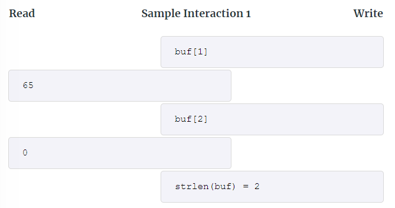
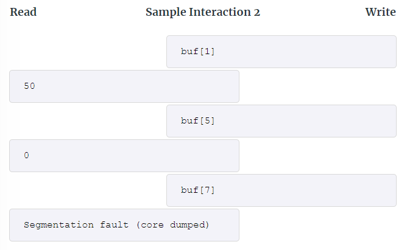
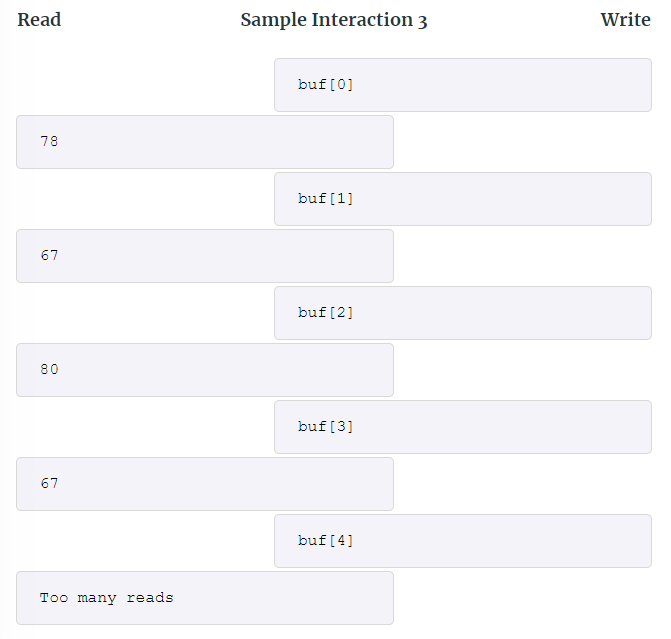
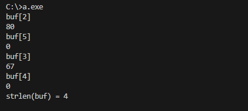
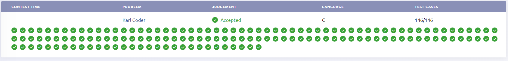

> **This problem is from ICPC competition that I participated in on 7th of October, 2023.**

## [Problem statement](https://ncpc23.kattis.com/contests/ncpc23/problems/karlcoder)

Karl is an aspiring C programmer, and is excited by the risks and rewards of low-level manual memory management. In the program he currently develops, he stores a string containing *N* non-zero bytes into a buffer named "buf". By mistake he accidentally made the buffer 2*N* bytes in size. The last bytes *N* of the buffer consists of only zero-bytes.

Now Karl needs to know the value *N*, the size of the string, in a separate part of the program. Traditionally you would recover the length of a string using the `strlen`-function, which reports the position of the first zero-byte in the provided buffer using a linear scan. However, Karl finds that this is much too slow, and that it defeats the advantage of using C in the first place. Can you help Karl efficiently recover *N* without crashing his program?

<figure style="border: none;">
    
    <figcaption>The contents of the buffer in sample interaction 3 are shown here.</figcaption>
</figure>

### Interaction

This is an interactive problem where interaction proceeds in rounds. In each round your program can attempt to read a byte from the buffer or report the answer (the value of *N*):

##### read

Write a line containing "buf[*i*]" if you want to try to read byte *i* of the buffer. If $ 0 \leq i \leq 2N $, then you will get the value of the byte stored in the buffer at index *i*. If $ i < N $ then this will be an integer between *1* and *255*, otherwise it will be *0*. If $ i \geq 2N $ or $ i < 0 $, you will get the response `"Segmentation fault (core dumped)"` and your program should exit.

##### write

Write a line containing "`strlen(buf) = M`" if you want to report that you think that $ N = M $. Afterwards your program should exit. Your submission will be accepted if you answered correctly, if you did not trigger a segmentation fault, and if you did not attempt to read entries from the buffer too many times.

A maximum of $ 2\lceil log_2N\rceil $ reads can be made. If your program attempts to read from the buffer after reaching the limit, it will get the response "Too many reads" and your program should then exit.

It is guaranteed that $ 2 \leq N \leq 10^{18} $.





<hr>

## [Solution](https://github.com/Miradils-Blog/dsa-problems-and-solutions/tree/main/icpc/2023/The2023NordicCollegiateProgrammingContest/KarlCoder)

This is a little bit different kind of problem. We do not have any input, but we can interact with program. As indicated in problem, we cannot do linear search, as we will hit request limit. We also cannot randomly query the data, as if we are out of bounds, we will get error message and end the program. So, we need a different approach. Let's do this in steps:

#### Step 1: Find the first zero

Let's see how far we can query each time. If we know that, *i*th element is non-zero, it means, string length is at least $ i + 1 $ which in turn means, buffer size is at least $ 2(i + 1) $. If we can estimate the max buffer size at each step, we can easily query and index in that range, without going out of bounds! If we start from index 2 (as $ N \geq 2 $), we can easily find the zero we need.

```C
#include <stdio.h>

int main()
{
    long long ind = 2, res, nonzeroind = 1;
    printf("buf[%lld]\n", ind);

    int bufval;

    while ((res = scanf("%d", &bufval)) == 1)
    {
        if (bufval > 0)
        {
            nonzeroind = ind;
            ind = (2 * ind + 1);
            printf("buf[%lld]\n", ind);
        }
        else
        {
            // Next step
        }
    }

    return 0;
}
```

> The code `while ((res = scanf("%d", &bufval)) == 1)` is used in case there is string answer (segmentation fault or too many requests), we should end the program, but, we might also skip it, as our program is never going to trigger those.

#### Step 2: Binary Search

Now that we have found the index of zero, the length we are searching for is between last non-zero value index and index of zero. After this, for optimality, we can use binary search, and find the bordering zero and non-zero values, which is our needed result. So, we can change our code:

```C
#include <stdio.h>

int main()
{
    long long ind = 2, res, nonzeroind = 1;
    setvbuf(stdout, NULL, _IONBF, 0);
    printf("buf[%lld]\n", ind);

    int bufval;

    while ((res = scanf("%d", &bufval)) == 1)
    {
        if (bufval > 0)
        {
            nonzeroind = ind;
            ind = (2 * ind + 1);
            printf("buf[%lld]\n", ind);
        }
        else
        {
            while (ind - nonzeroind > 1)
            {
                long long newind = (nonzeroind + ind) / 2;
                printf("buf[%lld]\n", newind);

                scanf("%d", &bufval);

                if (bufval)
                    nonzeroind = newind;
                else
                    ind = newind;
            }

            printf("strlen(buf) = %lld\n", nonzeroind + 1);
            return 0;
        }
    }

    return 0;
}
```

> The line `setvbuf(stdout, NULL, _IONBF, 0);` is used to not buffer the output. Usually, `printf` prints after output buffer size is maximized, but with this command, it never buffers, writing as soon as it gets the string. If we do not use this, our solution won't be accepted.

If we run this code, with the example in the picture above:



Seems like it works! It also took 4 steps, which is upper bound for us. So, if we submit this code:



Passed all 146 cases! Yay! You can access the code [here](https://github.com/Miradils-Blog/dsa-problems-and-solutions/tree/main/icpc/2023/The2023NordicCollegiateProgrammingContest/KarlCoder). Feel free to contribute your solution in different language!
