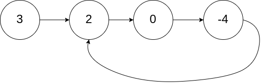
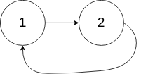
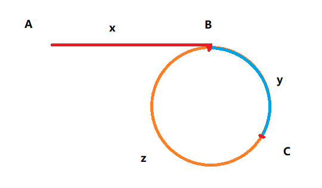
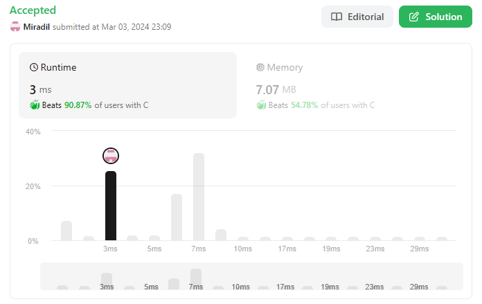

> **NOTE:** The problem [141: "Linked List Cycle"](https://leetcode.com/problems/linked-list-cycle/) is a subproblem of this problem, so the solution can be slightly modified to solve that too.

## [Problem statement](https://leetcode.com/problems/linked-list-cycle-ii/)

Given the `head` of a linked list, return *the node where the cycle begins*. *If there is no cycle, return* `null`.

There is a cycle in a linked list if there is some node in the list that can be reached again by continuously following the `next` pointer. Internally, `pos` is used to denote the index of the node that tail's `next` pointer is connected to **(0-indexed)**. It is `-1` if there is no cycle. **Note that `pos` is not passed as a parameter.**

### Example 1



> **Input:** `head = [3,2,0,-4], pos = 1`</br>
> **Output:** `tail connects to node index 1`</br>
> **Explanation:** `There is a cycle in the linked list, where tail connects to the second node.`

### Example 2



> **Input:** `head = [1,2], pos = 0`</br>
> **Output:** `tail connects to node index 0`</br>
> **Explanation:** `There is a cycle in the linked list, where tail connects to the first node.`

### Example 3


> **Input:** `head = [1], pos = -1`</br>
> **Output:** `no cycle`</br>
> **Explanation:** `There is no cycle in the linked list.`

### Constraints

- The number of the nodes in the list is in the range $[0, 10^4]$.
- $ -10^5 \leq Node.val \leq 10^5 $
- `pos` is `-1` or a valid index in the linked-list.

### Follow Up

Can you solve it using O(1) (i.e. constant) memory?

#### Default Code

```C
/**
 * Definition for singly-linked list.
 * struct ListNode {
 *     int val;
 *     struct ListNode *next;
 * };
 */
struct ListNode *detectCycle(struct ListNode *head) {}
```

<hr>

## [Solution](https://github.com/Miradils-Blog/dsa-problems-and-solutions/tree/main/leetcode/142-linked-list-cycle-ii)

This is one of the most popular problems in data structures. Although it can be solved in various ways, such as collecting visited nodes in the list and ensuring every time you visit a new node, `O(n)` space and at least `O(nlogn)` time complexity would be required. There is a simple algorithm that allows us to solve this problem with `O(1)` memory space and `O(n)` time complexity:

### Floyd's Cycle Finding Algorithm or Hare-Tortoise Algorithm

This algorithm uses two pointers, where one of the pointers moves twice as fast (hare) than the other one (tortoise). If there is a loop, it is ensured that the fast pointer will loop and catch the slow pointer. So, if pointers meet at the same node, we can conclude that a loop exists:

```C
struct ListNode *detectCycle(struct ListNode *head) {
    struct ListNode *fast = head, *slow = head;

    while (fast != NULL && fast->next != NULL) // check next steps of `fast` pointer
    {
        fast = fast->next->next;
        slow = slow->next;

        if (fast == slow)
        {
            // loop found
        }
    }

    return NULL; // no loop found
}
```

> **Note:** We have solved "Leetcode 141: Linked List Cycle" by this point.

Now, we need to find the beginning node of the loop. This part is a little bit trickier. There are two ways of explaining this part: math (which we will do) and visual.

### Visual Explanation

There is an astonishingly detailed visual explanation by [Oleksandr Klymenko](https://medium.com/@zephyr.ventum) at [Medium](https://medium.com/@zephyr.ventum/floyds-tortoise-and-hare-cycle-finding-algorithm-my-over-explanation-5631c5ce71d7). However, we will explore the math explanation.

### Math Explanation

So, let's visualize a cycled linked list like this:



Where `A` is the head of the linked list, `B` is the cycle start node, and `C` is where pointers (fast and slow) meet. We know that:

- `slow` moved `x + y` reaching point `C`.
- `fast` moved `x + y + z + y` reaching point `C`.

We also know that `fast` moves twice as much as `slow`. So, `fast` has traveled twice the length of `slow`. So, we can conclude that:

$$ 2(x + y) = x + 2y + z $$
$$ 2x + 2y = x + 2y + z $$
$$ 2x = x + z $$
$$ x = z $$

Turns out, from the point that pointers met till the starting cycle node is the same distance as that of from the head. So, if we put one of the pointers to the head and move at the SAME speed, the pointers will meet exactly at the cycle start node. The slow pointer will travel from `A` to `B` by `x`, and the fast one will travel from `C` to `B` by `z`. So, the overall code will be:

```C
struct ListNode *detectCycle(struct ListNode *head) {
    struct ListNode *fast = head, *slow = head;

    while (fast != NULL && fast->next != NULL)
    {
        fast = fast->next->next;
        slow = slow->next;

        if (fast == slow)
        {
            slow = head;
            while (fast != slow)
            {
                fast = fast->next;
                slow = slow->next;
            }

            return slow; // they will meet at the cycle node
        }
    }

    return NULL; // no loop found
}
```

If we submit this:



Accepted with high runtime efficiency! You can access the code [here](https://github.com/Miradils-Blog/dsa-problems-and-solutions/tree/main/leetcode/142-linked-list-cycle-ii). Feel free to contribute your solution in a different language!
