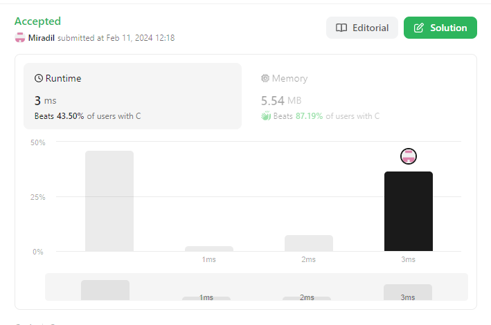
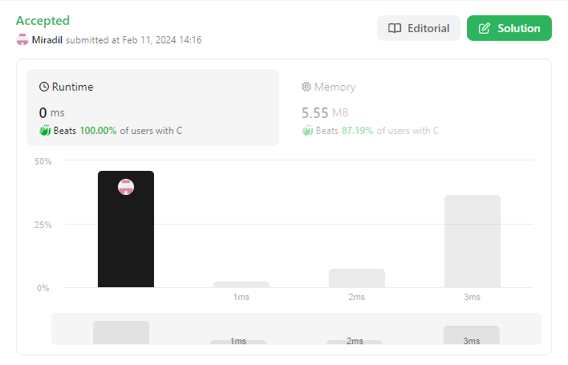

## [Problem statement](https://leetcode.com/problems/length-of-last-word/)

Given a string `s` consisting of words and spaces, return *the length of the **last** word in the string*.

A **word** is a maximal substring consisting of non-space characters only.

### Example 1

**Input:** `s = "Hello World"`</br>
**Output:** `5`</br>
**Explanation:** `The last word is "World" with length 5.`

### Example 2

**Input:** `s = "   fly me   to   the moon  "`</br>
**Output:** `4`</br>
**Explanation:** `The last word is "moon" with length 4.`

### Example 3

**Input:** `s = "luffy is still joyboy"`</br>
**Output:** `6`</br>
**Explanation:** `The last word is "joyboy" with length 6.`

### Constraints

- `1 <= s.length <= $10^4$`
- `s` consists of only English letters and spaces `' '`.
- There will be at least one word in `s`.

### Default Code

```C
int lengthOfLastWord(char* s) {}
```

<hr>

## [Solution](https://github.com/Miradils-Blog/dsa-problems-and-solutions/tree/main/leetcode/58-length-of-last-word)

One would think that, this is an easy task, where you get the whole string, parse it and get the length of last word. It is correct, however, considering we are solving in C, there is even better way to do it. However, we are going to do in both aprroaches. Even though it does not really matter in this case, considering input is read and parsed before passing it to the given function, we will explore both options.

### Approach 1: Parse string with `strtok`

So, that's what comes to the mind first: parse by space, and get the last word and its length! So, let's do that. Remember that, parsing function in C is `strtok`:

```C
int lengthOfLastWord(char* s)
{
    char* token = strtok(s, " ");
    char *last_word = NULL;

    while (token != NULL)
    {
        last_word = token;
        token = strtok(NULL, " ");
    }

    return strlen(last_word);
}
```

If we submit this:



Okay, submission is accepted, but stats can be better. Let's try another approach.

### Approach 2: Parse string with `sscanf`

With `sscanf` one would ask? You see, `scanf` and relative functions gets string values quite different by nature: it scans the string to the value TILL WHITESPACE. So, we can use it to get words by whole.

```C
int lengthOfLastWord(char* s)
{
    char word[10001];
    int len = 0;

    while(sscanf(s, "%s%n", word, &len) > 0)
        s += len;

    return strlen(word);
}
```

So, what did we do:

1. Used `%n` to get the number of scanned characters
2. Move pointer to the next word after each scan.
3. Continue till the EOF, and return length of last scanned string.

Simple, as that! So, if LeetCode allowed us, we could have done this without even storing the string, parsing right from `stdin`. This would have increase both memory and runtime of the program. If we submit this solution:


We got the best time in runtime! That\s perfect, however, we still use kind of much memory (mostly because of `word[10000]`). So, what if we drop all tools and try hardcore loop search?

#### Approach 3: Loop search

Of course, we can do everything old-fashioned way:

```C
int lengthOfLastWord(char* s)
{
    int count = 0;
    int i = strlen(s) - 1;

    // we can check this without checking `i`
    // because, there is always at least one word
    while (s[i] == ' ')
        --i;

    while (i >= 0 && s[i] != ' ')
        ++count, --i;

    return count;
}
```

And if we submit:



Accepted with the best time, and better memory usage! Yay!

You can access the code [here](https://github.com/Miradils-Blog/dsa-problems-and-solutions/tree/main/leetcode/58-length-of-last-word). Feel free to contribute your solution in different language!
