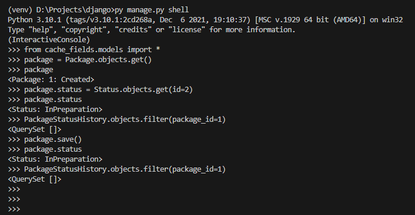
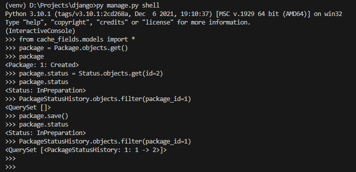

## The Problem

While working on Django project, we have every now and then needed to know if a specific field of model has changed or not, and act accordingly. Let's say, you are developing a logistics website, and want to store status changes of packages whenever there is one. So, you would have model structure similar to something like this:

```Python
from django.contrib.auth import get_user_model
from django.db import models

UserModel = get_user_model()

class Status(models.Model):
    name = models.CharField(max_length=32, unique=True)


class Package(models.Model):
    user = models.ForeignKey(UserModel, on_delete=models.CASCADE)
    shipment_cost = models.DecimalField(max_digits=6, decimal_places=2)
    weight = models.DecimalField(max_digits=5, decimal_places=2)
    status = models.ForeignKey(Status, on_delete=models.CASCADE)


class PackageStatusHistory(models.Model):
    package = models.ForeignKey(Package, on_delete=models.CASCADE)
    from_status = models.ForeignKey(Status, on_delete=models.CASCADE, related_name='from_status', null=True)
    to_status = models.ForeignKey(Status, on_delete=models.CASCADE, related_name='to_status')
    created_at = models.DateTimeField(auto_now_add=True)
```

Then, one would add `post_save` signals, and register the status change:

```Python
@receiver(post_save, sender=Package)
def register_status_change(sender, instance: Package, **kwargs):
    old_status_id = ...
    if instance.status_id != old_status_id:
        # There is a status change
        PackageStatusHistory.objects.create(package_id=instance.id,
                                            from_status_id=old_status_id,
                                            to_status_id=instance.status_id)
```

The problem is, we do not know the old status id! If somewhere in the code we do `package.status = new_status`, the `status` field of that class/model has changed, and old value is lost. There are some ways to tackle this problem, and we will analyze some of them.

> Note:
> We manually added 5 statuses: Created, InPreparation, Shipped, Received, Delivered.
> We also added one package with id=1 for testing.

## Solution 1: Query the old value

We know that, Django models contain the old values that we manually changed, until `refresh_from_db()` is called. We can use this to our advantage: what if we get the old status from database, and check it with "dirty" django model?

```Python
@receiver(post_save, sender=Package)
def register_status_change(sender, instance: Package, **kwargs):
    old_status_id = Package.objects.get(id=instance.id).status_id
    if instance.status_id != old_status_id:
        # There is a status change
        PackageStatusHistory.objects.create(package_id=instance.id,
                                            from_status_id=old_status_id,
                                            to_status_id=instance.status_id)
```

If we check:



What? Why our status history is empty? Here is why: we are using `post_save`, so the database call for old value happens AFTER we write a new value to the database. We could have switched to pre-save signal (so that we read old value before we update databse), however, we need to add extra handler: when the package is created for the first time, it has no id to pass to `PackageStatusHistory`:

```Python
@receiver(pre_save, sender=Package)
def register_status_change(sender, instance: Package, **kwargs):
    old_status_id = instance.id and Package.objects.get(id=instance.id).status_id

    if instance.status_id != old_status_id:
        # There is a status change
        PackageStatusHistory.objects.create(package_id=instance.id,
                                            from_status_id=old_status_id,
                                            to_status_id=instance.status_id)
```

Now, if we try this:



> Notice how we used `old_status_id = instance.id and Package.objects.get(id=instance.id).status_id`
> It is a nice shortcut for `if` statement: `and` statement executes second part (right-hand part) **ONLY IF** the first part is "`True`".
> In our case, if `id` is `None`, second part is not executed, so value is `old_status_id = None`
> If it is valid value, second part is executed: `old_status_id = Package.objects.get(id=instance.id).status_id`

So it works? Yes, however, it is not the best implementation. Every time you have change (even if not in `status` field) you will execute an extra database call, which, for large systems will slow you down.
