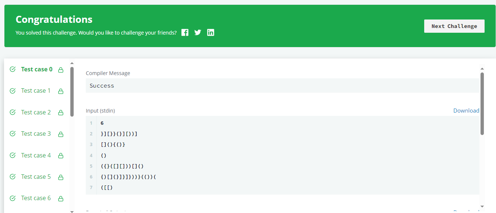

## [Problem statement](https://www.hackerrank.com/challenges/balanced-brackets/problem)

A bracket is considered to be any one of the following characters: `(`, `)`, `{`, `}`, `[`, or `]`.

Two brackets are considered to be a matched pair if the an opening bracket (i.e., `(`, `[`, or `{`) occurs to the left of a closing bracket (i.e., `)`, `]`, or `}`) of the exact same type. There are three types of matched pairs of brackets: `[]`, `{}`, and `()`.

A matching pair of brackets is not balanced if the set of brackets it encloses are not matched. For example, `{[(])}` is not balanced because the contents in between `{` and `}` are not balanced. The pair of square brackets encloses a single, unbalanced opening bracket, `(`, and the pair of parentheses encloses a single, unbalanced closing square bracket, `]`.

By this logic, we say a sequence of brackets is balanced if the following conditions are met:

- It contains no unmatched brackets.
- The subset of brackets enclosed within the confines of a matched pair of brackets is also a matched pair of brackets.

Given **n** strings of brackets, determine whether each sequence of brackets is balanced. If a string is balanced, return `YES`. Otherwise, return `NO`.

#### Function Description

Complete the function isBalanced in the editor below.</br>
isBalanced has the following parameter(s):

- string s: a string of brackets

#### Returns

- string: either `YES` or `NO`

#### Input Format

The first line contains a single integer **n**, the number of strings.</br>
Each of the next **n** lines contains a single string **s**, a sequence of brackets.

#### Constraints

- $1 \leq n \leq 10^3$
- $1 \leq \left|s\right| \leq 10^3$
- All chracters in the sequences ∈ { **{**, **}**, **(**, **)**, **[**, **]** }.

#### Output Format

For each string, return `YES` or `NO`.

#### Sample Input

```txt
STDIN           Function
-----           --------
3               n = 3
{[()]}          first s = '{[()]}'
{[(])}          second s = '{[(])}'
{{[[(())]]}}    third s ='{{[[(())]]}}'
```

#### Sample Output

```txt
YES
NO
YES
```

#### Explanation

1. The string `{[()]}` meets both criteria for being a balanced string.
2. The string `{[(])}` is not balanced because the brackets enclosed by the matched pair `{` and `}` are not balanced: `[(])`.
3. The string `{{[[(())]]}}` meets both criteria for being a balanced string.

<hr>

## [Solution](https://github.com/Miradils-Blog/dsa-problems-and-solutions/tree/main/hackerrank/balanced-brackets)

This is a quite popular problem in data structures. Considering the closing bracket should match the last opened bracket, we always need to know the last added opening bracket. Thus, we can use stack! However, C does not provide one, unlike C++. Instead, we can simulate it with an array and pointer (or index) at the top of the stack. Notice: the stack pointer points to the top element, not the next "empty" slot, thus, we start at -1, as there are no items in the stack initially.

```C
char* isBalanced(char* s) {

    char *stack = calloc(strlen(s), sizeof(char));
    int top = -1; // index of the top of the "stack"

    ...
}
```

So, we just need to store opening brackets, and pop them (or move the stack pointer) when the relative closing bracket comes as the next symbol:

```C
char* isBalanced(char* s) {
    char *stack = calloc(strlen(s), sizeof(char));
    int top = -1; // index of the top of the "stack"

    while(*s)
    {
        if (*s == '(' || *s == '{' || *s == '[')  // opening bracket, just add to stack
            stack[++top] = *s++;  // move stack pointer and get next string character
    }
    ...
}
```

Now, we just need to pop items from the stack if a matching closing bracket is spotted. Also, we need to consider if a closing bracket comes when the stack is empty:

```C
char* isBalanced(char* s) {

    char *stack = calloc(strlen(s), sizeof(char));
    int top = -1; // index of the top of the "stack"

    while(*s)
    {
        if (*s == '(' || *s == '{' || *s == '[')  // opening bracket, just add to stack
            stack[++top] = *s++;  // move stack pointer and get next string character
        else // it is a closing bracket
            if (top != -1 && ((*s == ')' && stack[top] == '(') ||
                              (*s == '}' && stack[top] == '{') ||
                              (*s == ']' && stack[top] == '[')))
                --top, ++s;  // "pop" element
            else
                break;
    }
    ...
}
```

Instead of having that many "and"s and "or"s, we can use a little "magic". If we look at ascii table (numbers are in decimal):

- `(` is 40, `)` is 41
- `[` is 91, `]` is 93
- `{` is 123, `}` is 125

The difference between these closing brackets is either 1 or 2! So, we can do simple if:

```C
char* isBalanced(char* s) {

    char *stack = calloc(strlen(s), sizeof(char));
    int top = -1; // index of the top of the "stack"

    while(*s)
    {
        if (*s == '(' || *s == '{' || *s == '[')  // opening bracket, just add to stack
            stack[++top] = *s++;  // move stack pointer and get next string character
        else // it is a closing bracket
            if (top != -1 && ((*s - stack[top]) == 1 || (*s - stack[top] == 2)))  // distance between opening/closing brackets are 1,2,2
                --top, ++s;
            else
                break;
    }
    ...
}
```

If the difference is not 1 or 2, we simply abort the loop. At the end, we just want to make sure that our stack is empty and that we processed all characters in `s` (and of course, we must free calloc-ed `stack` variable). So, the full code:

```C
char* isBalanced(char* s) {

    char *stack = calloc(strlen(s), sizeof(char));
    int top = -1; // index of the top of the "stack"

    while(*s)
    {
        if (*s == '(' || *s == '{' || *s == '[')  // opening bracket, just add to stack
            stack[++top] = *s++;  // move stack pointer and get next string character
        else // it is closing bracket
            if (top != -1 && ((*s - stack[top]) == 1 || (*s - stack[top] == 2)))  // distance between opening/closing brackets are 1,2,2
                --top, ++s;
            else
                break;
    }

    free(stack);

    // return yes, if stack is empty, i.e. all opening brackets are closed
    // and iterated through whole string without interruption
    return (*s == 0 && top == -1) ? "YES" : "NO";
}
```

If we submit:



If we do this in C++, the logic would be exactly the same, but by using the `stack` data structure, provided by C++:

```C++
string isBalanced(string s) {
    stack<char> st;
    int i = 0;

    for (; i < s.length(); ++i)
    {
        if (s.at(i) == '(' || s.at(i) == '{' || s.at(i) == '[')  // opening bracket, just add to stack
            st.push(s.at(i));  // add bracket to stack
        else // it is closing bracket
            if (!st.empty() && (abs(s.at(i) - st.top()) <= 2))  // distance between opening/closing brackets are 1,2,2
                st.pop();  // remove opened bracket from stack
            else
                break;
    }

    // return yes, if the stack is empty, i.e. all opening brackets are closed
    // and iterated through whole string without interruption
    return (i >= s.length() && st.empty()) ? "YES" : "NO";
}
```

Perfect, it works! Yay! You can find solutions [here](https://github.com/Miradils-Blog/dsa-problems-and-solutions/tree/main/hackerrank/balanced-brackets). Feel free to contribute your solution in a different language!
