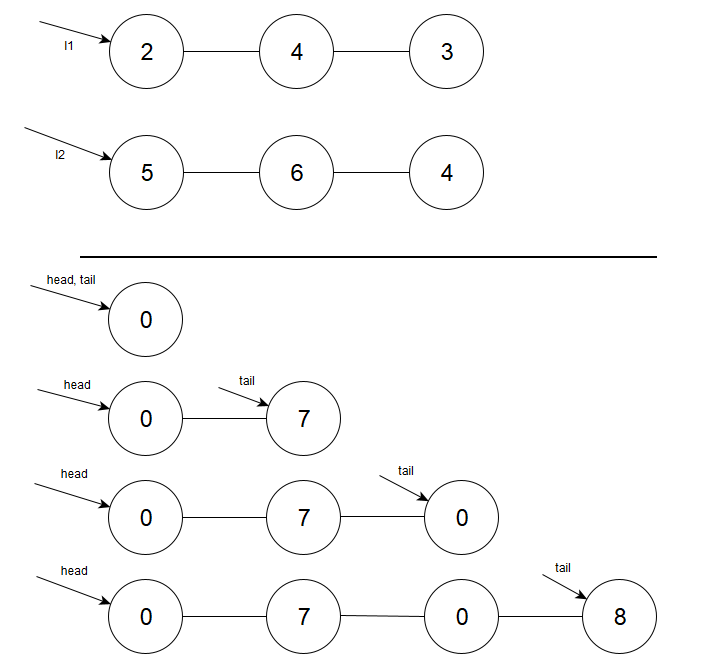

## [Problem statement](https://leetcode.com/problems/add-two-numbers/)

You are given two **non-empty** linked lists representing two non-negative integers. The digits are stored in **reverse order**, and each of their nodes contains a single digit. Add the two numbers and return the sum as a linked list.

You may assume the two numbers do not contain any leading zero, except the number 0 itself.

#### Example 1


**Input:** `l1 = [2,4,3], l2 = [5,6,4]`

**Output:** `[7,0,8]`

**Explanation:** `342 + 465 = 807.`

#### Example 2

**Input:** `l1 = [0], l2 = [0]`

**Output:** `[0]`

#### Example 3

**Input:** `l1 = [9,9,9,9,9,9,9], l2 = [9,9,9,9]`

**Output:** `[8,9,9,9,0,0,0,1]`

#### Constraints

- The number of nodes in each linked list is in the range `[1, 100]`.
- `0 <= Node.val <= 9`
- It is guaranteed that the list represents a number that does not have leading zeros.

#### Default Code

```C
/**
 * Definition for singly-linked list.
 * struct ListNode {
 *     int val;
 *     struct ListNode *next;
 * };
 */
struct ListNode* addTwoNumbers(struct ListNode* l1, struct ListNode* l2){}
```

<hr>

## [Solution](https://github.com/Miradils-Blog/dsa-problems-and-solutions/tree/main/leetcode/2-add-two-numbers)

The fact that, the input is given reverse, eases our task, as when we do addition, we start from units digit, then to tens etc. So, we need to go digit by digit, and sum them up, passing carry to the next digits:

```C
struct ListNode *addTwoNumbers(struct ListNode *l1, struct ListNode *l2)
{
    struct ListNode *tail = malloc(sizeof(struct ListNode));
    struct ListNode *head = tail;

    int a, b, c, carry = 0;

    while (l1 || l2 || carry == 1)
    {
        a = (l1) ? l1->val : 0;
        b = (l2) ? l2->val : 0;
        c = (a + b + carry);

        carry = c / 10;

        tail->next = malloc(sizeof(struct ListNode));
        tail = tail->next;
        tail->val = c % 10;
        tail->next = NULL;

        if (l1)
            l1 = l1->next;

        if (l2)
            l2 = l2->next;
    }

    return head->next;
}
```

So, what we do: we create a head which will be returned, and a tail which will move and create node for each calculated digit. Considering that the digit count of `l1` and `l2` might not be the same (one can be 5-digit, other 2), we need to check both of them. We also need to check the carry, even if we have used all digits of `l1` and `l2`, because it also creates a next digit (example: 101 + 899 = 1000). At each step, we add digits and calculate carry, each time we store the result in `next` node and pushing tail to that node:



Note that, right in the first iteration (i. e. first digit of result), we store value in `tail->next`, resulting in leading zero in linked list. That is why, when returning, we do not return `head` directly, instead, we skip that zero node. Why did we do it like that? Because, if you try to store first digit in the first node, your code will get a little bit messier. However, that way you actually reduce memory usage. Why don't you try it yourself?

So, if we submit our solution:


Accepted with high efficiency in runtime! Second solution would optimize the memory usage though. You can access the code [here](https://github.com/Miradils-Blog/dsa-problems-and-solutions/tree/main/leetcode/2-add-two-numbers). Feel free to contribute your solution in different language!
