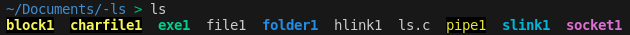

## Introduction
The `ls` command is one of the most commonly used commands in Linux/UNIX. This command is used to list the contents of a directory. Without any flags, we have the following output:

What are these colorful file names? Well, let's find out!

## File Types
