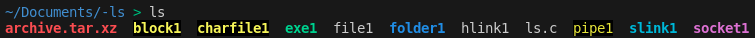

> **Note:** For the whole series, Zsh is used, for which, output can be different compared other shell profiles.

## Introduction

The `ls` command is one of the most commonly used commands in Linux/UNIX. This command is used to list the contents of a directory. Without any flags, we have the following output:

What are these colorful file names? Well, let's find out!

## File Types

There are 8 main types of files in Linux:

1. Regular files: Any file with no special "powers" are considered regular file. These files include text, image, video etc. files. Color code: **None**
2. Executable files: Files that can be executed/run. Color code: **Green**
3. Directory files: Practically folders. They store the location of other files. Color code: **Blue**
4. Block or Character special files: Hardware devices (hard, CD/DVD drives) are stored in Linux as special files. Color code: **Yellow + Black background**
5. Link Files: Files pointing to other files. Basically, shortcuts. Color code: **Cyan/Sky Blue** (**Red + Black Background** if link is broken)
6. Socket files: Communication endpoint for applications. Two applications can share data via socket files with each other. Color code: **Magenta**
7. Named pipe files: Also used for communication between applications. Difference is that socket communication is bidirectional, unlike pipe files. Also, pipes can be created between related processes (for ex. parent and child processes), however, there is no limitation for sockets. Color code: **Light Yellow + Black Background**
8. Archive files: Basically compressed/archived files. Color code: **Red**

There are more of course, but we will not dive into that. For more info, you can check [this answer](https://askubuntu.com/a/884513).

## Flags

Now that we know which file types we have, let's dig into command `ls` more. According to the [manual](https://man7.org/linux/man-pages/man1/ls.1.html), there are many flags for the command. The most used ones and the ones that we will rewrite are:

1. **-a:** Show hidden entries (a.k.a. files starting with `.`)
2. **-A:** Do not show current and previous directories (`.` and `..`)
3. **-C:** List entries in tabular format (by columns)
4. **-c:** with `-lt`: sort by, and show, ctime (time of last modification of file status information); with `-l`: show ctime and sort by name; otherwise: sort by ctime.
5. **-d:** List directories themselves, not their contents
6. **-f:** List all files in their order in directory, without any colors
7. **-F:** Append indicator (kind of like extension) to the end of filename, depending their type (one of */=>@|)
8. **-g:** Same as `-l`, but do not show owner.
9. **-G:** In list view, do not show group
10. **-h:** In list view, show file size in human-readable form (2G, 12M, etc.)
11. **-i:** Print inode (index number) of each file
12. **-l:** Show entries in long list format
13. **-m:** Show list as comma-separated values
14. **-n:** Same as `-l`, but show owner and group ID
15. **-p:** Put '/' at the end of directory names
16. **-Q:** All file names will be inside quotes
17. **-r:** Reverse order for sorting
18. **-R:** List all subdirectories recursively.
19. **-S:** Sort file by size, largest first
20. **-t:** Sort by time, newest first
21. **-u:** with `-lt`: sort by, and show, access time with `-l`: show access time and sort by name otherwise: sort by access time.
22. **-U:** Do not sort, list entries in directory order
23. **-X:** Sort alphabetically by file extensions
24. **-1:** List one file per line

## What is the plan?

We will rewrite `ls` command and its above-mentioned flags step-by-step, in C. We will deep-dive into Linux filesystem, permissions, users/groups etc. Moreover, we will use Test Driven Development and modular programming to ensure we write the most optimal code. To be honest, I am thrilled with this project, and I hope you are too!
