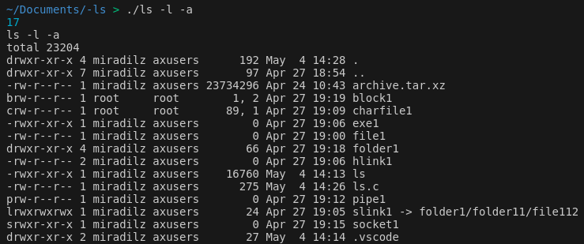
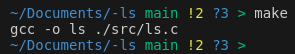
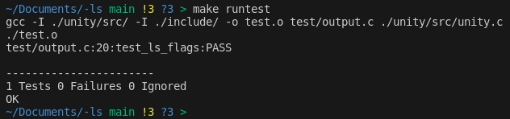
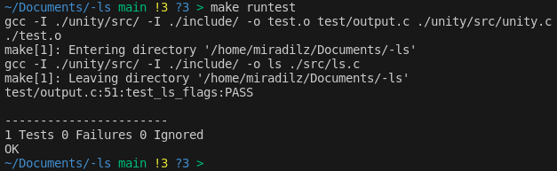

> **In this article we will start the first steps to rewrite `ls` command. If you want to know more about command, please read Part 1.**
>
> **Note:** Source codes can be found at: https://github.com/Miradils-Blog/linux-ls

## The easy way
Actually, C provides a function to run any OS command, and print its output: [system](https://www.tutorialspoint.com/c_standard_library/c_function_system.htm). From the example in the reference, we see that, we can just take arguments from shell and pass it to that function, and it is done. 

```
#include <stdio.h>
#include <stdlib.h>
#include <string.h>

int main(int argc, char *argv[])
{
    char command[50] = "ls ";

    for (int i = 1; i < argc; ++i)
    {
        strcat(command, argv[i]);
        strcat(command, " ");
    }

    system(command);
    return 0;
}

```

The first element of `argv` is always the name of executable, which we do not need, as we replace it with original `ls`. The rest of the arguments are copied to `command` variable, separated by spaces, and run. We get the following output:




That's it, tutorial is done.

#### Just Kidding!
Of course, we are not done! We will still write `ls` from scratch. Even though, this might be a way to test our code, we will use slightly different method to test our command, as it will be explained later.

## First, let's setup the environment
Before we start developing, we will setup the environment to be flexible for the future and automate our jobs. We will have `src` folder for source files, `include` for header files and `test` for tests. We will also have source and include files of unity (see later), so, any added file/framework should be easy for us to handle. For these, `make` will be used, and rules will be defined in corresponding `Makefile` file. You can learn more about `make` from [official documentation](https://www.gnu.org/software/make/manual/make.html). So, our initial `Makefile` would look like this:

```Makefile
CC = gcc
CFLAGS = -I ./include/
SRC_DIRS = ./src/

sources := $(wildcard $(SRC_DIRS)/*.c)

compile:
  $(CC) $(CFLAGS) -o ls $(sources)
```

Short explaination:
- We are defining `gcc` to be our compiler.
- We are including all files in `ìnclude` folder (now empty, for future header files).
- We are collecting all source files using wildcard.
- We are compiling all of them in `compile` rule.

Now, if we use `make`:



Perfect! Now we are done with setting up basic settings.

## Writing unit tests
Okay, time to start unit tests!!! We will use [Unity Test Framework](http://www.throwtheswitch.org/unity) to do unit testing. It is one of widely used testing frameworks alongside with [Check](https://libcheck.github.io/check/), [Google Test](https://google.github.io/googletest/) etc. Just downloading source code, and putting it to the project folder is enough to make it work (that is also why it is portable). 

#### Dummy test

So, let's right our first dummy unit test, just to configure everything, and make sure everything works:

```c
#include "unity.h"
#include <stdbool.h>

void setUp(void)
{
}

void tearDown(void)
{
}

void test_ls_flags(void)
{
    TEST_ASSERT_TRUE(true);
}

int main()
{
  UNITY_BEGIN();
  RUN_TEST(test_ls_flags);

  return UNITY_END();
}
```

We also need to add test rule to `Makefile`:

```Makefile
runtest:
	$(CC) $(CFLAGS) -o test.o test/output.c ./unity/src/unity.c
	./test.o
```

Here is output, when we run `make runtest`:




#### More realistic test unit
Sweet! Now, let's try to at least write the part where we get output of original `ls`, so we later compare it with output of ours. You could expect us to use `system` function. The only problem is that, that function just prints the output of command, instead of storing it somewhere. We could extend command to forward the output to some file (for ex. `ls -la > output.txt`) and read later from that file, however, it is inefficient. Instead, we will use `popen` function, which creates pipe (yes, yes, it is pipe file type that we have seen in Part 1) between command process and our code. We will get both outputs and compare them:

```c
void test_ls_flags(void)
{
  FILE *pipe;
  system("make"); // run 'make' to generate executable

  char *test_flags[] = {"-l", "-a", "-la"};  // list of flags to test
  char error_msg[100];
  int flag_cnt = sizeof(test_flags) / sizeof(char *);  // get the number of flags

  // Make sizes large enough to store outputs
  char ls_output[1024] = {0};
  char our_output[1024] = {0};
  char command[128];

  for (int i = 0; i < flag_cnt; ++i)
  {
    // Run original ls command and capture output
    sprintf(command, "ls %s", test_flags[i]);
    pipe = popen(command, "r");
    fread(ls_output, 1, 1024, pipe);
    pclose(pipe);

    // Run our code and capture output
    sprintf(command, "./ls %s", test_flags[i]);
    pipe = popen(command, "r");
    fread(our_output, 1, 1024, pipe);
    pclose(pipe);

    // Compare
    sprintf(error_msg, "Failed flag: %s", test_flags[i]);
    TEST_ASSERT_EQUAL_STRING_MESSAGE(ls_output, our_output, error_msg);
  }
}
```

Our code will loop through given flags and assert output of each flag. Our `ls.c` file is still the same, containing code to list with `system` command. That works for now, we just need to run basic test. So, output of the following is:





## Conclusion
For now, we are done with unit tests. Of course, unit tests should check functions and their behavior, but for now, we are only checking the global output of our command. Later, we will add unit tests for more specific functions. You can get codes from  this [repository](https://github.com/Miradils-Blog/linux-ls).
