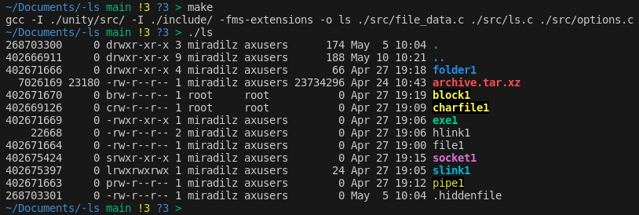

> **In this article we will start collecting info about files**
>
> **If you want to know more about command, please read Part 1.**
>
> **If you want to know how we configured tests, check Part 2.**
>
> **Note:** Source codes can be found at: <https://github.com/Miradils-Blog/linux-ls>

## Getting the list of files

First things first, our file structure looks like this (`tree` command was used for output):


We have separate folder with different types of files for us to cover all cases. For now, we will hard-code the folder where listing will happen, just focusing on functionality. So, how do we get the list of all files and their respective data about ownership, size, links etc.? Lucky for us, C provides function for this (and honestly, for everything else as well):

```c
#include <stdio.h>
#include <stdlib.h>
#include <string.h>
#include <dirent.h>

int main(int argc, char *argv[])
{

    DIR *dir;            // for reading directory
    struct dirent *file; // struct for getting file data

    dir = opendir("folder");

    while ((file = readdir(dir)) != NULL)
        printf("%s\n", file->d_name);

    return 0;
}
```

The output would be:


Okay, cool, we got the names of files. However, we need more than that. The flag `-lasi` requires all the data about every file in folder. For each normal and hidden file (`.` and `..` included) we need the following data:

|  I-node   | Block Size | Permissions  | Link Count |  Owner   | Owner Group | File size | Modification Time |               Name                |
| :-------: | :--------: | :----------: | :--------: | :------: | :---------: | :-------: | :---------------: | :-------------------------------: |
| 268703300 |     0      |  drwxr-xr-x  |     3      | miradilz |   axusers   |    174    |   May  5 10:04    |                 .                 |
| 402666911 |     0      |  drwxr-xr-x  |     9      | miradilz |   axusers   |    188    |   May 10 10:21    |                ..                 |
|  7026169  |   23180    | -rw-r-\-r-\- |     1      | miradilz |   axusers   | 23734296  |   Apr 24 10:43    |          archive.tar.xz           |
| 402671670 |     0      | brw-r-\-r-\- |     1      |   root   |    root     |   1, 2    |   Apr 27 19:19    |              block1               |
| 402669126 |     0      | crw-r-\-r-\- |     1      |   root   |    root     |   89, 1   |   Apr 27 19:09    |             charfile1             |
| 402671669 |     0      |  -rwxr-xr-x  |     1      | miradilz |   axusers   |     0     |   Apr 27 19:06    |               exe1                |
| 402671664 |     0      | -rw-r-\-r-\- |     1      | miradilz |   axusers   |     0     |   Apr 27 19:00    |               file1               |
| 402671666 |     0      |  drwxr-xr-x  |     4      | miradilz |   axusers   |    66     |   Apr 27 19:18    |              folder1              |
| 268703301 |     0      | -rw-r-\-r-\- |     1      | miradilz |   axusers   |     0     |   May  5 10:04    |            .hiddenfile            |
|   22668   |     0      | -rw-r-\-r-\- |     2      | miradilz |   axusers   |     0     |   Apr 27 19:06    |              hlink1               |
| 402671663 |     0      | prw-r-\-r-\- |     1      | miradilz |   axusers   |     0     |   Apr 27 19:12    |               pipe1               |
| 402675397 |     0      |  lrwxrwxrwx  |     1      | miradilz |   axusers   |    24     |   Apr 27 19:05    | slink1-> folder1/folder11/file112 |
| 402675424 |     0      |  srwxr-xr-x  |     1      | miradilz |   axusers   |     0     |   Apr 27 19:15    |              socket1              |




What are these data?

- **i-node**: Short for "index node". It is a file data structure storing every data (file size and type, UID and GUID of owner, permissions, last modification/access/change timestamps) except its name and content.
- **block size**: The number of blocks the file takes. 1 block is usually 512B, and it is the multiple of 4 (in my case).
- **permissions**: The first character is file type: `-` for normal file, `d` for directory, `b` for block, `c` for character, `p` for pipe, `l` for link and `s` for socket. The rest can be summarized with an image:




- **link count**: The number of hard links. That is how many files points to this file (soft links **excluded**).
- **owner**: The username of the owner. When flag is `-n`, UUID of owner is shown.
- **owner group**: The username of the group. When flag is `-n`, GUID is shown.
- **file size**: Size in bytes. When `-h` flag is set, it is shown in more readable form: 2M, 12K etc. For block and character files, their device number is shown instead of size.
- **modification time**: Shows the last modification time. For `-t` creation time, and for `-u` access time is shown.
- **name**: Name of the file. If file is link, unless `-L` flag is set, it shows the file it is linked to.

## Collecting all the necessary info

To easily access every attribute of file, let's use a struct. But, wait! C already has a [`struct stat`](https://man7.org/linux/man-pages/man2/lstat.2.html) which stores almost all needed information (we miss user name, group name, color etc.). Of course, we have to write functions to handle missing data. We can use those functions when needed (maybe when it is already print time), or we create another struct and fill it beforehand with everything. I prefer going with latter, as it is easier to handle everything. Let's create another identical struct with extra data......

### WAIT, YOU CAN EXTEND STRUCTS?

Yep, I am shocked as well. I found this at time writing this post, when this question suddenly struck me. After googling (and coming across this [answer](https://stackoverflow.com/a/14523823/8842262)), I found out that with gcc flag `-fms-extensions` one can indeed extend a struct. So, we have the following code:

```c
typedef struct
{
    struct stat;
    char name[256];
    char permission[11];
    char color[16];
    char extension[256];
    char indicator; // for -F and -p
    char owner_name[256];
    char group_name[256];

} file_info;
```

Now our struct `file_info` has its own attributes and attributes of `struct stat`. Now, question is: can we use this for C functions? Or do we need original `struct stat` and copy its contents? Let's check ourselves. We will try to get the size of files:

```c
#include <stdio.h>
#include <dirent.h>
#include <options.h>
#include <file.h>
#include <unistd.h>

int main(int argc, char *argv[])
{

    DIR *dir;            // for reading directory
    struct dirent *file; // struct for getting file data
    file_info files;

    chdir("folder");
    dir = opendir(".");

    while ((file = readdir(dir)) != NULL)
    {
        stat(file->d_name, (struct stat *)&files);
        printf("%s %d\n", file->d_name, files.st_size);
    }

    return 0;
}
```

Output:

```txt
. 174
.. 188
folder1 66
archive.tar.xz 23734296
block1 0
charfile1 0
exe1 0
hlink1 0
file1 0
socket1 0
slink1 0
pipe1 0
.hiddenfile 0
```

IT WORKS! If you check with `ls`, these are indeed the correct numbers. However, there are some data that is missing.

### Collecting the rest of the data

Now we need the following: get user and group name based on their IDs, construct permission string, parse and store extension of file, and based on file type get color and indicator. Let's go in the same order.

#### User and Group Names

Lucky for us, C provides to get user and group names from `/etc/passwd` and `/etc/group` files, respectively:

```c
void get_username_from_uid(int uid, char *username)
{
    struct passwd *pws;
    pws = getpwuid(uid);

    strcpy(username, pws->pw_name);
}

void get_groupname_from_gid(int gid, char *groupname)
{
    struct group *grp;
    grp = getgrgid(gid);

    strcpy(groupname, grp->gr_name);
}
```

#### Permission String

Unfortunately, for this, we do not have a ready function. Thus, we need to analyze every permission bit ourselves and construct a string. At least for this, C does provide needed functions:

```c
void construct_permission_str(mode_t mode, char *permission)
{
    // Get the first character from file type
    if      (S_ISREG(mode)) permission[0] = '-';
    else if (S_ISDIR(mode)) permission[0] = 'd';
    else if (S_ISLNK(mode)) permission[0] = 'l';
    else if (S_ISCHR(mode)) permission[0] = 'c';
    else if (S_ISBLK(mode)) permission[0] = 'b';
    else if (S_ISSOCK(mode)) permission[0] = 's';
    else if (S_ISFIFO(mode)) permission[0] = 'p';

    permission[1] = (mode & S_IRUSR) ? 'r' : '-';
    permission[2] = (mode & S_IWUSR) ? 'w' : '-';
    permission[3] = (mode & S_IXUSR) ? 'x' : '-';
    
    permission[4] = (mode & S_IRGRP) ? 'r' : '-';
    permission[5] = (mode & S_IWGRP) ? 'w' : '-';
    permission[6] = (mode & S_IXGRP) ? 'x' : '-';

    permission[7] = (mode & S_IROTH) ? 'r' : '-';
    permission[8] = (mode & S_IWOTH) ? 'w' : '-';
    permission[9] = (mode & S_IXOTH) ? 'x' : '-';
    permission[10] = 0;  // terminator char, just in case
}
```

#### Parse extension of file

This one is quite straightforward:

```c
void get_file_extension(char *file_name, char *extension)
{
    char *p = strrchr(file_name, '.');
    
    if (p)
        strcpy(extension, strrchr(file_name, '.'));
}
```

`strchr` is function which finds first occurence of given character and points there (NULL otherwise). `strrchr` is the same function, but reversed, meaning it shows the last occurence of given character. And for us, the last part, after dot is considered an extension.

#### Color and indicator

Again, nothing serious here:

```c
#define COLOR_RESET         "\x1b[0m" // reset color settings
#define COLOR_REGULAR       COLOR_RESET
#define COLOR_EXECUTABLES   "\x1b[1;32m"
#define COLOR_DIRECTORIES   "\x1b[1;34m"
#define COLOR_LINK          "\x1b[1;36m"
#define COLOR_FIFO          "\x1b[40;33m"
#define COLOR_SOCKET        "\x1b[1;35m"
#define COLOR_BLK_CHR       "\x1b[40;33;1m"
#define COLOR_BROKEN_LINK   "\x1b[40;31;1m"
#define COLOR_ARCHIVE       "\x1b[1;31m"

void get_color(char* permission, char *extension, char *color)
{
    switch (permission[0])
    {
    case '-':
        if (permission[3] == 'x' || permission[6] == 'x' || permission[9] == 'x')
            strcpy(color, COLOR_EXECUTABLES);
        else if (is_archive_file(extension))
            strcpy(color, COLOR_ARCHIVE);
        else
            strcpy(color, COLOR_REGULAR);
        break;
    case 'd':
        strcpy(color, COLOR_DIRECTORIES);
        break;
    case 'l':
        strcpy(color, COLOR_LINK);
        break;
    case 'c':
    case 'b':
        strcpy(color, COLOR_BLK_CHR);
        break;
    case 's':
        strcpy(color, COLOR_SOCKET);
        break;
    case 'p':
        strcpy(color, COLOR_FIFO);
        break;
    default:
        break;
    }
}

char get_indicator(char* permission)
{
    switch (permission[0])
    {
    case '-':
        if (permission[3] == 'x' || permission[6] == 'x' || permission[9] == 'x')
            return '*';
        
        return ' '; 
    case 'd':
        return '/';
    case 'l':
        return '@';
    case 's':
        return '=';
    case 'p':
        return '|';
    default:
        return ' ';
    }
}

```

`is_archive_file` is just function checking if the extension corresponds to archive file or not. What are these weird color values? Those are MAGIC! With super useful [ASCII escape codes](https://en.wikipedia.org/wiki/ANSI_escape_code#Examples) we can format and color our output. I got the exact values for those constants with `dircolors -p` command.

## Collecting everything together

So, now we have everything ready as separate parts and functions, let's join them and get full array of file info:

```c
#include <stdio.h>
#include <dirent.h>
#include <options.h>
#include <file_data.h>
#include <unistd.h>
#include <string.h>
#include <time.h>

int main(int argc, char *argv[])
{

    DIR *dir;            // for reading directory
    struct dirent *file; // struct for getting file data
    file_info files[256];  // For now static array

    chdir("folder");
    dir = opendir(".");
    int i = 0;

    while ((file = readdir(dir)) != NULL)
    {
        lstat(file->d_name, (struct stat *)&files[i]);

        strcpy(files[i].name, file->d_name);
        get_username_from_uid(files[i].st_uid, files[i].owner_name);
        get_groupname_from_gid(files[i].st_gid, files[i].group_name);
        construct_permission_str(files[i].st_mode, files[i].permission);
        get_file_extension(files[i].name, files[i].extension);
        get_color(files[i].permission, files[i].extension, files[i].color);
        
        files[i].indicator = get_indicator(files[i].permission);
        ++i;
    }

    char filetime[20];
    struct tm *timeinfo;

    for (int j = 0; j < i; ++j)
    {
        timeinfo = localtime(&files[j].st_mtime);
        strftime(filetime, 20, "%b %-2d %H:%M", timeinfo);

        printf("%9d %5d %s %d %-8s %-7s %8d %s %s%s%s\n", files[j].st_ino, files[j].st_blocks / 2, files[j].permission, files[j].st_nlink, 
                                                    files[j].owner_name, files[j].group_name, files[j].st_size, filetime, files[j].color, files[j].name, COLOR_RESET);
    }

    return 0;
}
```

Guess the output?



**VS**


VOILA! Almost perfect output :) 

## Conclusion

Of course, we are missing some data:

- First and foremost, the formatting. The original `ls` output adjusts every column by its most wide line, however, we have done that manually.
- The order of files in outputs are different.
- For char and block files, instead of size, device numbers should be shown. We have that data in `struct stat` we just need separate if statement and formatting to fix that.
- For soft links, their reference files should be shown.

But for now, these are okay, because, we are sure that we collected all needed data about all files in directory. In the upcoming posts we will handle all of these issues and have one-to-one same output.

You can get codes from this [repository](https://github.com/Miradils-Blog/linux-ls).
