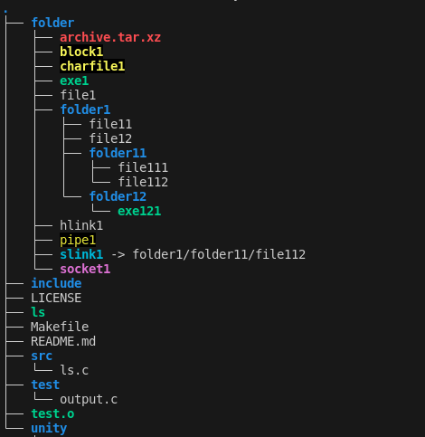

> **In this article we will start processing some flags of `ls` command.**
>
> **If you want to know more about command, please read Part 1.**
>
> **If you want to know how we configured tests, check Part 2.**
>
> **If you want to know how we collected info about files, check Part 3.**
>
> **Note:** Source codes can be found at: <https://github.com/Miradils-Blog/linux-ls>

## Getting the list of files

First things first, let's remember how our file structure looks like (`tree` command was used for output):



In [previous part](../part3/) we collected all necessary info of all files and printed them out. However, we used them only for printing, nothing else. For some flags, we don't even need the info of certain files (by default, we do not need info of hidden files, or in case of `-A` we do not need data of current (`.`) and previous (`..`) directory, etc.). So, we need to process the flags to know which files do we need to collect data of, and how to print the needed output.


## Analyzing Print Style Flags

First, we will look at flags that affect our printing style:

- **-C**: List entries in tabular format (by columns) (default)
- **-f**: List all files in tabular format (by columns), without color, in non-sorted order
- **-g:** Same as `-l`, but do not show owner.
- **-l:** Show entries in long list format
- **-m:** Show list as comma-separated values
- **-n:** Same as `-l`, but show owner and group ID
- **-x:** List entries by lines
- **-1:** List one file per line

Each of these flags affect the output style. Moreover, they override each other: if our flag is `-lm`, `m` will override `l` and output will be comma-separated. Otherwise, if flag is `-ml`, output will be list, that is, one file per line with extra data. So, how can we handle this easily? Enums, right! We will create a new file `options.h` and store that enum there:

```c
typedef enum
{
    TABULAR_FORMAT,         // -C (default), -f
    LIST_FORMAT,            // -g, -l, -n, -1
    COMMA_SEPARATED_FORMAT, // -m
    ONE_LINE_FORMAT,        // -x
} print_style_t;
```

Okay, what's next? As we will have a lot of options/styles (show/hide hidden files, sort options, views etc.) depending on flags, let's group them into one object. Thus, we will create a struct to store all options after parsing flags. Right now, we will keep it minimal, and add more options as we process more flags:

```c
typedef struct
{
    print_style_t print_style;
} options_t;
```

Now, we can write parser for above mentioned flags:

```c
#include <options.h>
#include <stdio.h>

void parse_flags(char *flags[], int count, options_t *options)
{
    for (int i = 0; i < count; ++i)
    {
        if (flags[i][0] == '-') // it is a flag
        {
            while (*(++flags[i])) // iterate through characters/flags
            {
              switch (*flags[i])
              {
              case 'C':
              case 'f':
                  options->print_style = TABULAR_FORMAT;
                  break;
              case 'g':
              case 'l':
              case 'n':
              case '1':
                  options->print_style = LIST_FORMAT;
                  break;
              case 'm':
                  options->print_style = COMMA_SEPARATED_FORMAT;
                  break;
              case 'x':
                  options->print_style = ONE_LINE_FORMAT;
                  break;
              default:
                  break;  
              }
          }
       }
    }
}
```

We can see that, `print_style` is set according to the "latest" flag. Moreover, `1`, `l`, `n` and `g` has the same format, but latter three shows extra info about all files. But, they also affect our output, so we need to handle them. For example, all three flags override `-1`, and `-g` overrides `-l`. So, let's create another stuct to handle these flags:

```c
typedef struct
{
    bool show_extra_data;  // -l, -g, -n
    bool show_owner_ids;  // -n
    bool show_owner;  // -g
} long_list_settings_t;
```

Right now, this is enough to handle most cases. Nevertheless, we will add a new struct here later, which will store data of the width of each column, so that we have identical output as `ls`. So, snippet above can be adjusted as:

```c
switch (*flags[i])
{
case 'C':
    options->print_style = TABULAR_FORMAT;
    break;
case 'f':
    options->print_style = TABULAR_FORMAT;
    break;
case 'g':
    options->ll_settings.show_owner = false;
    options->ll_settings.show_extra_data = true;
    options->print_style = LIST_FORMAT;
    break;
case 'l':
    options->ll_settings.show_extra_data = true;
    options->print_style = LIST_FORMAT;
    break;
case 'm':
    options->print_style = COMMA_SEPARATED_FORMAT;
    break;
case 'n':
    options->ll_settings.show_owner_ids = true;
    options->ll_settings.show_extra_data = true;
    options->print_style = LIST_FORMAT;
    break;
case 'x':
    options->print_style = ONE_LINE_FORMAT;
    break;
case '1':
    options->print_style = LIST_FORMAT;
    break;
default:
    break;  
}
```

We are done with print format flags! Next, we will look into sorting flags.

## Sort flags

Similar to printing style, there are multiple flags which define sorting, and they too, override each other:

- **-c:** with `-lt`: sort by, and show, ctime (time of last modification of file status information); with `-l`: show ctime and sort by name; otherwise: sort by ctime.
- **-f:** List all files in their order in directory, without any colors. This flag turns off the -l, -t, -s, and -r flags, and turns on the -a flag.
- **-S:** Sort file by size, largest first
- **-t:** Sort by time, newest first. Default by "last modification time".
- **-u:** with `-lt`: sort by, and show, access time with `-l`: show access time and sort by name otherwise: sort by access time.
- **-U:** Do not sort, list entries in directory order
- **-X:** Sort alphabetically by file extensions

Now, we have interesting case here: `-c` and `-u` affect long list output depending on other flags. They also **cannot** override other sort flags. So, we need to add new_entry to `long_list_settings_t`, which will indicate which time attribute of file we need to show. Moreover, we sort by that attribute if our output is not long list, or `-t` flag is also set. We need another enum to store our sorting option:

```c
typedef enum
{
    BY_ALPHABETICAL,          // (default)
    NO_SORT,                  // -f, -U
    BY_MODIFICATION_TIME,     // -t
    BY_CHANGE_TIME,           // -c
    BY_ACCESS_TIME,           // -u
    BY_SIZE,                  // -S
    BY_ALPHABETICAL_EXTENSION // -X
} sort_option_t;
```

We also need to extend our `long_list_settings_t` struct:

```c
typedef enum
{
    MODIFICATION_TIMESTAMP,  // mtime
    CHANGE_TIMESTAMP,        // ctime
    ACCESS_TIMESTAMP         // atime
} time_attribute_t;

typedef struct
{
    bool show_extra_data;  // -l, -g, -n
    bool show_owner_ids;  // -n
    bool show_owner;  // -g
    time_attribute_t show_time_attribute;  // -u, -t, -c
} long_list_settings_t;
```

By default, every sorting is in descending order, unless `-r` flag is set. We will just have boolean for storing the order of sort. If we add these changes to our `options` struct, and change `parse_flags` function:

```c
switch (*flags[i])
{
case 'c':
    options->ll_settings.show_timestamp = CHANGE_TIMESTAMP;
    break;
case 'f':
    options->print_style = TABULAR_FORMAT;
    options->sort_by = NO_SORT;
    options->show_hidden_files = true;
    options->show_curr_prev_dirs = true;
    options->colorful_output = false;
    break;
case 'S':
    options->sort_by = BY_SIZE;
    break;
case 't':
    options->sort_by = BY_MODIFICATION_TIME;
    break;
case 'u':
    options->ll_settings.show_timestamp = ACCESS_TIMESTAMP;
    break;
case 'U':
    options->sort_by = NO_SORT;
    break;
case 'X':
    options->sort_by = BY_ALPHABETICAL_EXTENSION;
    break;
default:
    break;  
}
```

Now, we also have to know if we need to sort by access/change time:

```c
// If active sort option is BY_MODIFICATION_TIME, meaning -t 
// is set, check if -u or -c is also set, and change sorting accordingly.
if (options->sort_by == BY_MODIFICATION_TIME)
    // Little hack: The orders in enums are the same, so we can use math
    options->sort_by += options->ll_settings.show_timestamp;
else if (options->print_style != LIST_FORMAT && !options->sort_by && options->ll_settings.show_timestamp)
    // In non-list view, if no sort option was specified and if show timestamp is not in default value 
    // (MODIFICATION_TIMESTAMP=0), it means -u or -c is set, so, they become our sort option
    options->sort_by = BY_MODIFICATION_TIME + options->ll_settings.show_timestamp;
```

If we were explain this part again: `BY_MODIFICATION_TIME` is set when there is `-t` flag. If it was not overriden by any other flag, it means, we will sort by time. However, it is possible that, `-u` or `-c` were set, and we can check them through `options->ll_settings.show_timestamp` enum value. Otherwise, if it is not long list format, and no sort option was specified, `-u` and `-c` will become sorting option, which again can be checked from the same enum as before.

## The rest of the flags

Now, we are left with:
- **-a:** Show hidden entries (a.k.a. files starting with `.`)
- **-A:** Do not show current and previous directories (`.` and `..`)
- **-d:** List directories themselves, not their contents
- **-F:** Append indicator (kind of like extension) to the end of filename, depending their type (one of */=>@|)
- **-G:** In list view, do not show group
- **-h:** In list view, show file size in human-readable form (2G, 12M, etc.)
- **-i:** Print inode (index number) of each file
- **-p:** Put '/' at the end of directory names
- **-Q:** All file names will be inside quotes
- **-r:** Reverse order for sorting
- **-R:** List all subdirectories recursively.

All of them are one boolean field in struct, and they do not override each other (except `-a` and `-A`). So, we can finalize our functions as:


```c
#include <parser.h>
#include <stdio.h>
#include <stdbool.h>
#include <string.h>

void init_options(options_t *options)
{
    memset(options, 0, sizeof(*options));  // Initialize all values to zero

    options->ll_settings.show_owner = true;
    options->ll_settings.show_owner_group = true;
    options->colorful_output = true;
    options->show_directory_content = true;
}

void parse_flags(char *flags[], int count, options_t *options)
{
    for (int i = 0; i < count; ++i)
    {
        if (flags[i][0] == '-') // it is a flag
        {
            while (*(++flags[i])) // iterate through characters/flags
            {
                switch (*flags[i])
                {
                case 'a':
                    options->show_hidden_files = true;
                    options->show_curr_prev_dirs = true;
                    break;
                case 'A':
                    options->show_hidden_files = true;
                    options->show_curr_prev_dirs = false;
                    break;
                case 'c':
                    options->ll_settings.show_timestamp = CHANGE_TIMESTAMP;
                    break;
                case 'C':
                    options->print_style = TABULAR_FORMAT;
                    break;
                case 'd':
                    options->show_directory_content = false;
                    break;
                case 'f':
                    options->print_style = TABULAR_FORMAT;
                    options->sort_by = NO_SORT;
                    options->show_hidden_files = true;
                    options->show_curr_prev_dirs = true;
                    options->colorful_output = false;
                    break;
                case 'F':
                    options->append_file_indicators = true;
                    options->append_directory_indicator = true;
                    break;
                case 'g':
                    options->ll_settings.show_owner = false;
                    options->ll_settings.show_extra_data = true;
                    options->print_style = LIST_FORMAT;
                    break;
                case 'G':
                    options->ll_settings.show_owner_group = false;
                    break;
                case 'h':
                    options->ll_settings.show_readable_size = true;
                    break;
                case 'i':
                    options->show_inode = true;
                    break;
                case 'l':
                    options->ll_settings.show_extra_data = true;
                    options->print_style = LIST_FORMAT;
                    break;
                case 'm':
                    options->print_style = COMMA_SEPARATED_FORMAT;
                    break;
                case 'n':
                    options->ll_settings.show_owner_ids = true;
                    options->ll_settings.show_extra_data = true;
                    options->print_style = LIST_FORMAT;
                    break;
                case 'p':
                    options->append_directory_indicator = true;
                    break;
                case 'Q':
                    options->inside_quotes = true;
                    break;
                case 'r':
                    options->reverse_sort = true;
                    break;
                case 'R':
                    options->recursive = true;
                    break;
                case 'S':
                    options->sort_by = BY_SIZE;
                    break;
                case 't':
                    options->sort_by = BY_MODIFICATION_TIME;
                    break;
                case 'u':
                    options->ll_settings.show_timestamp = ACCESS_TIMESTAMP;
                    break;
                case 'U':
                    options->sort_by = NO_SORT;
                    break;
                case 'x':
                    options->print_style = ONE_LINE_FORMAT;
                    break;
                case 'X':
                    options->sort_by = BY_ALPHABETICAL_EXTENSION;
                    break;
                case '1':
                    options->print_style = LIST_FORMAT;
                    break;
                default:
                    break;  
                }
            }
        }
    }

    // If active sort option is BY_MODIFICATION_TIME, meaning -t 
    // is set, check if -u or -c is also set, and change sorting accordingly.
    if (options->sort_by == BY_MODIFICATION_TIME)
        // Little hack: The orders in enums are the same, so we can use math
        options->sort_by += options->ll_settings.show_timestamp;
    else if (options->print_style != LIST_FORMAT && !options->sort_by && !options->ll_settings.show_timestamp)
        // In non-list view, if show timestamp is not MODIFICATION_TIMESTAMP, it means
        // -u or -c is set, so, if there is no other sort option, they become our sort option
        options->sort_by = BY_MODIFICATION_TIME + options->ll_settings.show_timestamp;
}
```

We also added `init_options` function, which initializes struct by its default values.

## Testing 

Now that we are done with processing flags, let's test our code. In [part 2](../part2/) we configured Unity Test Framework for future use. Now, we will test `parse_flag` function and make sure all flags are set correctly. Let's create a new file `test_parser.c` and check different flags there.
