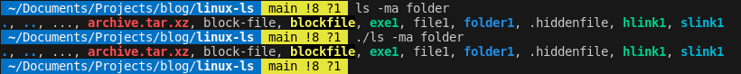
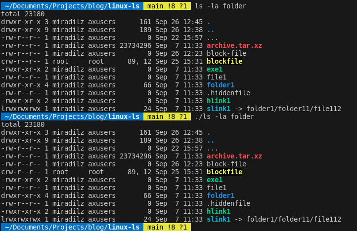
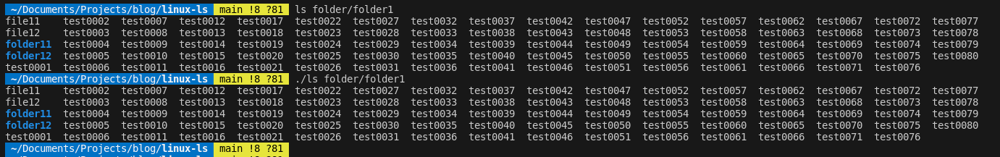
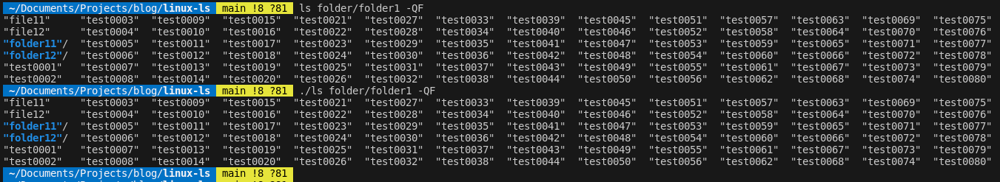
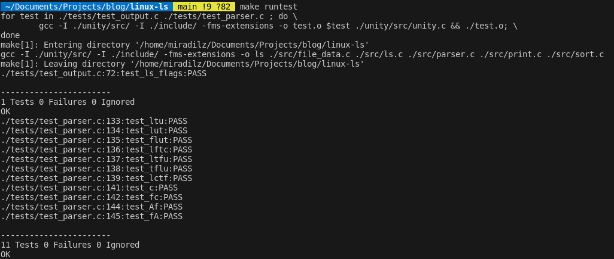

> **In this article we will apply flags from previous post and format output `ls` command.**
>
> **If you want to know more about command, please read Part 1.**
>
> **If you want to know how we configured tests, check Part 2.**
>
> **If you want to know how we collected info about files, check Part 3.**
>
> **If you want to know how we processed the flags, check Part 4**
>
> **Note:** Source codes can be found at: <https://github.com/Miradils-Blog/linux-ls>

## What is done and what is left

In [previous part](../part4/) we parsed all flags and stored them. Now, it is time to apply those flags, and get nice output, as expected! However, we still need to consider some details:

1. To find the shell width, so, for tabular output, we calculate how many columns we have
2. To get max length of each column, so, column size is dynamic to longest row
3. Sort file entries according to given flags

### 1. Get the shell width

Lucky for us, C already provides function for us to get shell width: `ioctl` with `TIOCGWINSZ`. Let's get this value, and store it in struct:

```C
typedef struct
{
    int win_size;
    
} widths_t;


/////// IN DIFFERENT FILE ///////

#include <sys/ioctl.h>

int get_window_size()
{
    struct winsize w;
    ioctl(0, TIOCGWINSZ, &w);
    return w.ws_col;
}

widths_t widths;
widths.win_size = get_window_size();

```

### 2. Store max width of each column

You remember our main loop? It looks like this:

```C
while ((file = readdir(dir)) != NULL)
{
    lstat(file->d_name, (struct stat *)&files[i]);

    strncpy(files[i].name, file->d_name, 256);
    get_username_from_uid(files[i].st_uid, files[i].owner_name);
    get_groupname_from_gid(files[i].st_gid, files[i].group_name);
    construct_permission_str(files[i].st_mode, files[i].permission);
    get_file_extension(files[i].name, files[i].extension);
    get_color(files[i].permission, files[i].extension, files[i].color);
    
    files[i].indicator = get_indicator(files[i].permission);
    ++i;
}
```



For each file, we can get length of each attribute, and of course, store it in our above defined struct. So, our struct and loop will grow bigger. Thus, we need to refactor code a little bit to have everything structured and readable:



```C
#define NUM_LEN(n) (snprintf(0, 0, "%+d", (n)) - 1)

void update_widths(widths_t *widths, file_info *file)
{
    widths->inode_width = max(widths->inode_width, NUM_LEN(file->st_ino));
    widths->nlink_width = max(widths->inode_width, NUM_LEN(file->st_nlink));
    widths->ownerid_width = max(widths->ownerid_width, NUM_LEN(file->st_uid));
    widths->ownername_width = max(widths->ownername_width, strlen(file->owner_name));
    widths->groupid_width = max(widths->groupid_width, NUM_LEN(file->st_gid));
    widths->groupname_width = max(widths->groupname_width, strlen(file->group_name));

    int size_width = NUM_LEN(file->st_size);
    if (S_ISCHR(file->st_mode) || S_ISBLK(file->st_mode))
        size_width = NUM_LEN(major(file->st_rdev)) + NUM_LEN(minor(file->st_rdev)) + 2; // major, minor

    widths->size_width = max(widths->size_width, size_width);
}

int get_file_data_from_dir(char *directory, file_info *files, options_t *options, widths_t *widths)
{
    DIR *dir;            // for reading directory
    struct dirent *file; // struct for getting file data

    chdir(directory);
    dir = opendir(".");
    int i = 0;

    while ((file = readdir(dir)) != NULL)
    {
        if (file->d_name[0] == '.' && !options->show_hidden_files)
            continue;

        if ((!strcmp(file->d_name, ".") || !strcmp(file->d_name, "..")) && !options->show_curr_prev_dirs)
            continue;

        lstat(file->d_name, (struct stat *)&files[i]);

        strncpy(files[i].name, file->d_name, 256);
        get_username_from_uid(files[i].st_uid, files[i].owner_name);
        get_groupname_from_gid(files[i].st_gid, files[i].group_name);
        construct_permission_str(files[i].st_mode, files[i].permission);
        get_file_extension(files[i].name, files[i].extension);
        get_color(files[i].permission, files[i].extension, files[i].color);

        files[i].indicator = get_indicator(files[i].permission);
        update_widths(widths, &files[i]);

        ++i;
    }

    return i;
}

```

We are using an useful macro for finding the number of digits in number, which is useful for us to find the max length of column for size, UID, GID etc.

**Note:** In the size column, for block and char type files, output is not the size, instead, it is major and minor device numbers. Thus, we need to handle it accordingly. We are also handling flags, where we ignore some files, depending on them.

### 3. Sort entries

As we have all the flags processed, we already know by which factor we will sort, and whether it is reverse sort or not. For this we will be using `qsort` function, and provide comparators for each case. For these functions, we will create separate file, as we are going to have many comparators. But, our general `sort` function will look like this:

```C
void sort(file_info *files, int count, options_t *options)
{
    int (*cmp_func)(const void *, const void *);

    switch (options->sort_by)
    {
    case BY_ALPHABETICAL:
        cmp_func = (!options->reverse_sort) ? cmp_alphabetical_asc : cmp_alphabetical_desc;
        break;
    case BY_ALPHABETICAL_EXTENSION:
        cmp_func = (!options->reverse_sort) ? cmp_alphabetical_ext_asc : cmp_alphabetical_ext_desc;
        break;
    case BY_ACCESS_TIME:
        cmp_func = (!options->reverse_sort) ? cmp_atime_desc : cmp_atime_asc;
        break;
    case BY_CHANGE_TIME:
        cmp_func = (!options->reverse_sort) ? cmp_ctime_desc : cmp_ctime_asc;
        break;
    case BY_MODIFICATION_TIME:
        cmp_func = (!options->reverse_sort) ? cmp_mtime_desc : cmp_mtime_asc;
        break;
    case BY_SIZE:
        cmp_func = (!options->reverse_sort) ? cmp_size_asc : cmp_size_desc;
        break;
    default:
        return;
    }

    qsort(files, count, sizeof(file_info), cmp_func);
}
```

We have created pointer to comparator function in the beginning of function, and assigned it to needed comparator depending on sort flags. Then, we call `qsort` function with comparator, and sort files in expected order. Note that, time based comparators are reversed: that is because, we need to show newest first, by default. The comparators are all the same, each comparing with different field of struct:

```C
static int cmp_alphabetical_asc(const void *a, const void *b)
{
    char *name1 = ((file_info *)a)->alphanum_name;
    char *name2 = ((file_info *)b)->alphanum_name;

    int len_cmp = strlen(((file_info *)a)->name) - strlen(((file_info *)b)->name);
    if (strlen(name1) || strlen(name2))
        len_cmp = -len_cmp;

    return strcasecmp(name1, name2) ?: len_cmp;
}
static int cmp_alphabetical_desc(const void *a, const void *b) 
{ 
    return -cmp_alphabetical_asc(a, b); 
}

static int cmp_atime_desc(const void *a, const void *b)
{
    return (((file_info *)b)->st_atime - ((file_info *)a)->st_atime) ?: cmp_alphabetical_asc(a, b);
}
static int cmp_atime_asc(const void *a, const void *b) { return -cmp_atime_asc(a, b); }


// The rest of comparators
```

As it was shown above, we have comparators for each field, both for ascending and descending sort. Note that, descending comparators are just inverse/negative of ascending comparators. For comparators of time (atime, ctime and mtime) we need second comparator as well, in case time values are the same, so we use alphabetical comparator.

#### IMPORTANT NOTE ABOUT NAME COMPARATOR

When sorting by name, `ls` originally ignores `'.'` in the beginning of filename, so, filename `aa.txt` comes before `.ab`, even though, from ASCII perspective, `'.'` precedes all letters. Because of this, before comparing names, we move pointer forward, and compare actual names. But, now the question arises: how does it compare `.` and `..` (and if maybe even have `...`)? After we remove, '.' character from these file names, two empty strings are compared, which results not being sorted (`strcmp` returns 0, so no changes). In this case, checking the length of original name is enough for us to compare.

#### What the hell is `?:` operator?

To be honest, I stumbled on this while writing this post. I have implemented something similar in Python before: `a = val1 or val2` would assign `val1` if it was non-zero/not-null value, otherwise `val2` would be assigned. Using `||` in C does not work, as it returns boolean value of 1 or 0. However, GCC has `?:` operator ([docs](https://gcc.gnu.org/onlinedocs/gcc/Conditionals.html)) which fulfills our requirement. So, when `strcmp` returns zero, the lengths will be compared.

## Printing

That's it! We are done with everything and now it is time to print everything with the data we have. As we know from previous parts, we have three types of output: tabular, linear and comma-separated. The last one is the easiest to implement:

### 1. Comma Separated

```C
static void print_comma_sep(file_info *files, int count, options_t *options, widths_t *widths)
{
    printf("%s", COLOR_RESET); // reset color, in case previous command did not
    print_name(files[0], options);

    for (int i = 1; i < count; ++i)
    {
        printf(", ");
        print_name(files[i], options);
    }

    printf("\n");
}
```

And here is our output, compared to original `ls`.



**The function `print_name` is used to print color, file name, quotes and indicators if needed, with needed padding (for tabular format).**

### 2. List

For list printing, we just print everything we know, with the widths we already calculated, so our entries are aligned:

```C
static void print_list(file_info *files, int count, options_t *options, widths_t *widths)
{
    if (options->show_total)
        printf("total %d\n", widths->total_blocks);

    for (int i = 0; i < count; ++i)
    {

        if (options->show_inode)
            printf("%*d ", widths->inode_width, files[i].st_ino);

        if (options->ll_settings.show_extra_data)
        {
            printf("%s ", files[i].permission);
            printf("%*d ", widths->nlink_width, files[i].st_nlink);

            if (options->ll_settings.show_owner)
            {
                if (options->ll_settings.show_owner_ids)
                    printf("%*d ", widths->ownerid_width, files[i].st_uid);
                else
                    printf("%-*s ", widths->ownername_width, files[i].owner_name);
            }

            if (options->ll_settings.show_owner_group)
            {
                if (options->ll_settings.show_owner_ids)
                    printf("%*d ", widths->groupid_width, files[i].st_gid);
                else
                    printf("%-*s ", widths->groupname_width, files[i].group_name);
            }

            if (S_ISCHR(files[i].st_mode) || S_ISBLK(files[i].st_mode))
            {
                char devices[10];
                sprintf(devices, "%d, %d", major(files[i].st_rdev), minor(files[i].st_rdev));
                printf("%*s ", widths->size_width, devices);
            }
            else
                printf("%*d ", widths->size_width, files[i].st_size);

            char filetime[14];
            struct tm *timeinfo;

            if (options->ll_settings.show_timestamp == ACCESS_TIMESTAMP)
                timeinfo = localtime(&files[i].st_atime);
            else if (options->ll_settings.show_timestamp == CHANGE_TIMESTAMP)
                timeinfo = localtime(&files[i].st_ctime);
            else
                timeinfo = localtime(&files[i].st_mtime);

            // For files which was accessd/modified was a looong time ago, format is ("%b %e  %Y")

            strftime(filetime, 15, "%b %e %H:%M ", timeinfo);
            printf("%13s", filetime);
        }

        print_name(files[i], options);

        if (options->ll_settings.show_extra_data && files[i].permission[0] == 'l')
        {
            printf(" -> ");

            int len;
            char buff[256];
            file_info linked_file;

            len = readlink(files[i].name, buff, sizeof(buff));
            strncpy(linked_file.name, buff, len);
            linked_file.name[len] = 0;

            stat(files[i].name, (struct stat *)&linked_file);
            construct_permission_str(linked_file.st_mode, linked_file.permission);
            get_color(linked_file.permission, linked_file.extension, linked_file.color);
            linked_file.indicator = get_indicator(linked_file.permission);

            print_name(linked_file, options);
        }

        printf("\n");
    }
}
```

We print i-node if needed, and other info if our flag is not `-1`. When it comes to size, char and block devices show their major and minor values, so we handle that accordingly as well. If we have link among files, we also print the name of the file it refers to. Thus, we have the following output:



### 3. Tabular

Now, this is the trickiest part. Originally, `ls` tries to maximize column count, while keeping output in border of window length. Even though, we know the window length, we cannot directly find optimal column count, as the order and the length of file names affect that value. Upon searching solution in the internet, I found [this astonishingly detailed answer](https://stackoverflow.com/a/75575528/8842262). So, here is how I implemented it:

```C

typedef struct
{
    int valid;
    int line_len;
    int max_len[256]; // Max possible length for each col
} column_info;

#define MIN_COLUMN_WIDTH 3 // 1 char + 2 spaces

static int get_column_count(column_info *column_configs, file_info *files, int file_count, widths_t *widths, options_t *options)
{
    int max_idx = widths->window_width / MIN_COLUMN_WIDTH - 1;
    int max_cols = (max_idx < file_count) ? max_idx : file_count;
    int inode = (options->show_inode) ? widths->inode_width : 0;

    for (int file_idx = 0; file_idx < file_count; ++file_idx)
    {
        for (int config_idx = 0; config_idx < max_cols; ++config_idx)
        {
            if (!column_configs[config_idx].valid)
                continue; // Skip invalid configurations

            int rows = (file_count + config_idx) / (config_idx + 1);

            // If too much allocated column/row space
            if ((rows * (config_idx + 1) - file_count) > rows)
            {
                column_configs[config_idx].valid = 0;
                continue;
            }

            // find file column
            int col = file_idx / rows;

            int name_width = strlen(files[file_idx].name);

            if (options->inside_quotes)
                name_width += 2;

            if (options->append_file_indicators && files[file_idx].indicator)
                name_width += 1;
            else if (options->append_file_indicators && files[file_idx].permission[0] == 'd')
                name_width += 1;

            // Check if the file name width exceeds the current column width
            if (name_width > column_configs[config_idx].max_len[col])
            {
                column_configs[config_idx].line_len += name_width - column_configs[config_idx].max_len[col];
                column_configs[config_idx].max_len[col] = name_width;
            }

            // Consider spaces as well
            if (column_configs[config_idx].line_len + (2 * config_idx) + (inode * (config_idx + 1)) > widths->window_width)
                column_configs[config_idx].valid = 0;
        }
    }

    // Find the highest valid configuration
    int selected_config = max_cols - 1;
    while (selected_config >= 0 && (!column_configs[selected_config].valid || !column_configs[selected_config].max_len[selected_config]))
        selected_config--;

    return selected_config + 1; // Return the number of columns
}

static void
print_tabular(file_info *files, int file_count, options_t *options, widths_t *widths)
{
    column_info column_configs[256] = {[0 ... 255] = {1, 0, 0, 0}};

    int ncols = get_column_count(column_configs, files, file_count, widths, options);
    int nrows = (file_count + ncols - 1) / ncols;

    for (int i = 0; i < nrows; i++)
    {
        for (int j = 0; j < ncols; j++)
        {
            int file_idx = i + j * nrows;

            if (options->show_inode)
                printf("%*d ", widths->inode_width, files[file_idx].st_ino);

            print_padded_name(files[file_idx], options, column_configs[ncols - 1].max_len[j]);
            if (j < ncols - 1)
                printf("  ");
        }
        printf("\n");
    }
}
```

We iterate through every file, with every possible column configuration. For each column configuration, we find its total line length (including spaces, and inode, if needed), and maximum length of each column. If at some point, the line length of configuration exceeds window length, we set it invalid. At the end of iterations, we find the configuration with highest column count, which is, of course, valid.

**NOTE:** We also need to be sure that, configuration has widths for each column, i.e. no column is empty, as, it is possible to have 19-column configuration, and fill only 16. Thus, we check the number of allocated spaces vs total files, and if it is too much, we set configuration invalid. We have the following output:



Notice how the padding and column count changes, if we add `-QF` flags, which affects the whole line length, thus, calculations:



## Tests

All we need is to make sure out tests run correct:

```C
void test_ls_flags(void)
{
    // TEST_IGNORE(); // until we fix our code, we will ignore this test unit
    FILE *pipe;
    system("make"); // run 'make' to generate executable

    char *test_flags[] = {
        "-mr",
        "-1i",
        "-l",
        "-A",
        "-lA",
        "-gtu",
        "-qpu",
        "-FQ",
        "-i",
    }; // list of flags to test
    char *original_ls_flags[] = {
        "--format=commas",
        "",
        "",
        "--format=across",
        "",
        "",
        "--format=across",
        "--format=across",
        "--format=across",
    };

    char error_msg[100];
    int flag_cnt = sizeof(test_flags) / sizeof(char *); // get the number of flags

    for (int i = 0; i < flag_cnt; ++i)
    {
        // Make sizes large enough to store outputs
        char ls_output[1024] = {0};
        char our_output[1024] = {0};
        char command[128];

        // Run original ls command and capture output
        sprintf(command, "ls folder/ %s -w 0 --color=always %s", test_flags[i], original_ls_flags[i]);
        pipe = popen(command, "r");
        fread(ls_output, 1, 1024, pipe);
        pclose(pipe);

        // Run our code and capture output
        sprintf(command, "./ls folder/ %s", test_flags[i]);
        pipe = popen(command, "r");
        fread(our_output, 1, 1024, pipe);
        pclose(pipe);

        // Compare
        sprintf(error_msg, "Failed flag: %s", test_flags[i]);
        TEST_ASSERT_EQUAL_STRING_MESSAGE(ls_output, our_output, error_msg);
    }
}
```

Consider that, we just give flags in array, and test all of them in loop with original `ls` command. By default, `ls` does not show colors, when used with pipe, so we use `--color=always` to have comparison with colors. Moreover, the separator symbol in `ls` also changes when used with pipe. For example, even though `ls` will produce column-wise output in shell, if used in pipe, the files will be separated by `\n` character, instead of double space. To handle this, we also force `ls` format (`across` for tabular, `comma` for comma separated), depending on command we are using. Overall, our result is:



## Conclusion

THAT'S IT. We are done with journey, it was exhausting, but really fun one. I really enjoyed while working on it, and learned new things as well. I know, I missed some flags (such as `-h`, `-R`, `-d` etc.), and my code might have some gaps or bugs. My [repository](https://github.com/Miradils-Blog/linux-ls/) is open for PRs, if you have suggestions, you are welcome to contribute. I am finishing series here, but I might return to this project to finish the other flag as well, maybe, sometime in the future. Thank you for being a part of this long journey!
